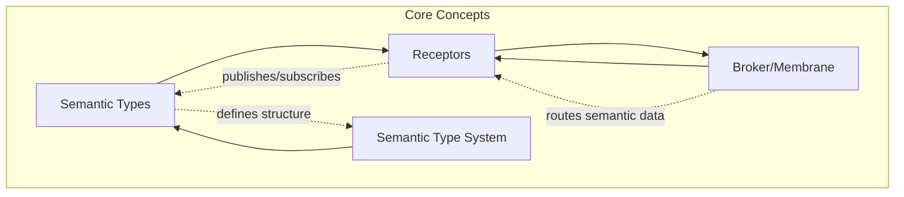
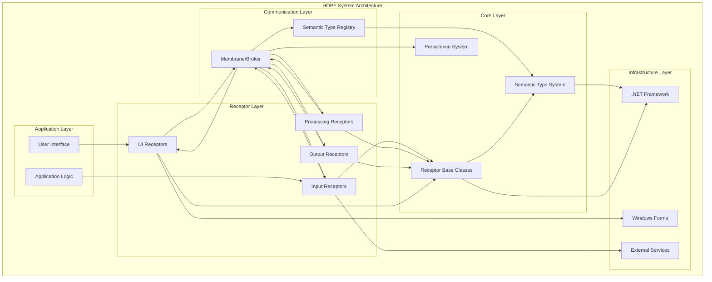
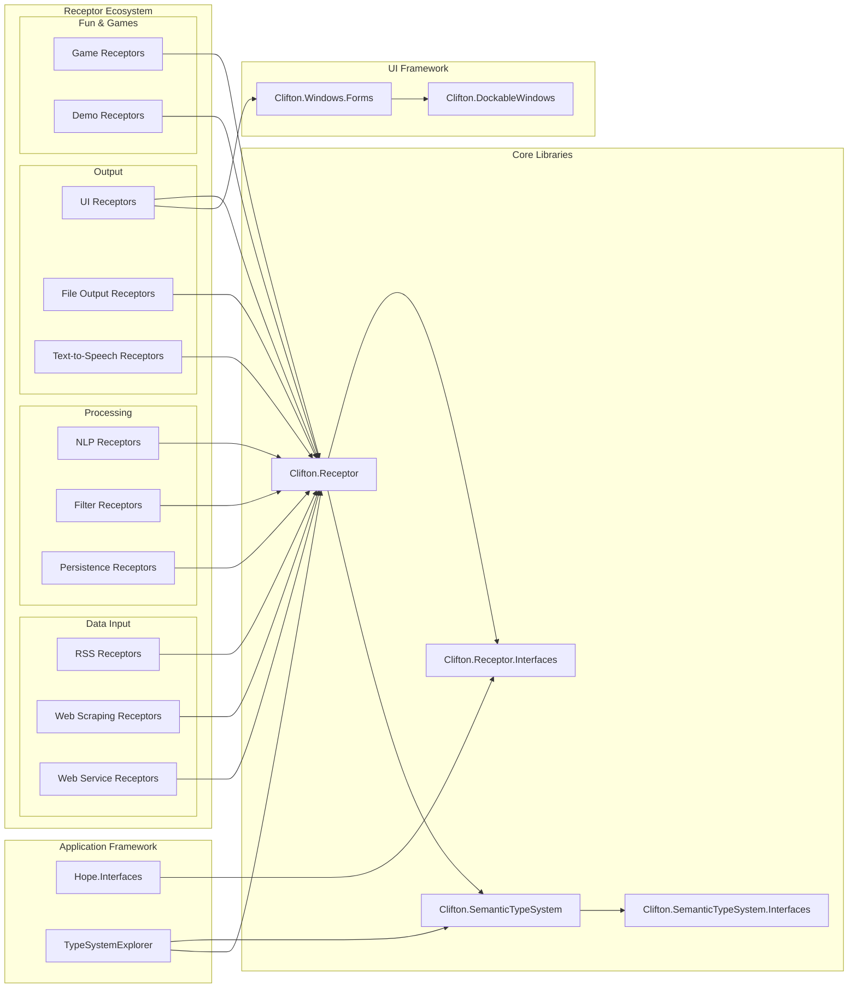
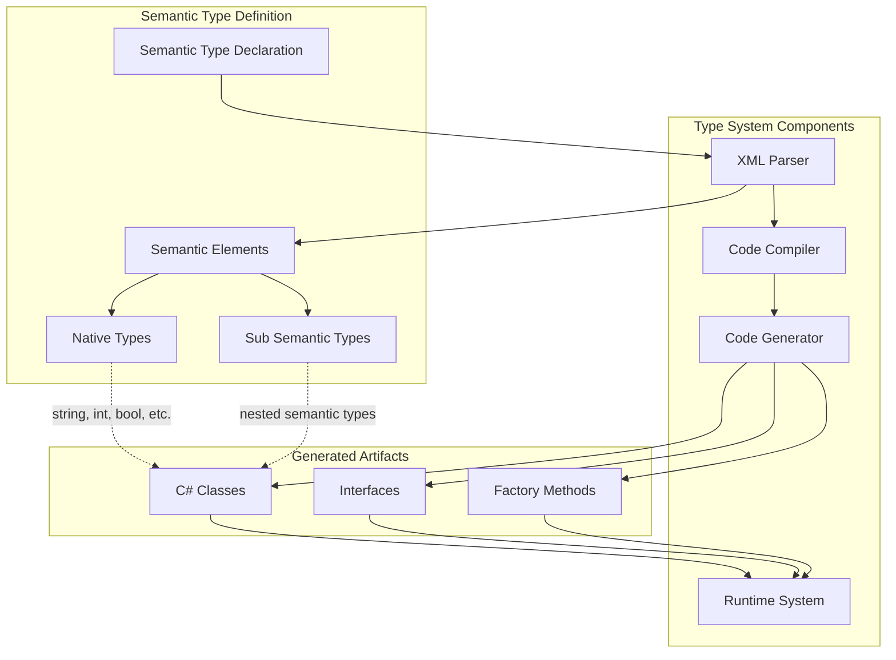
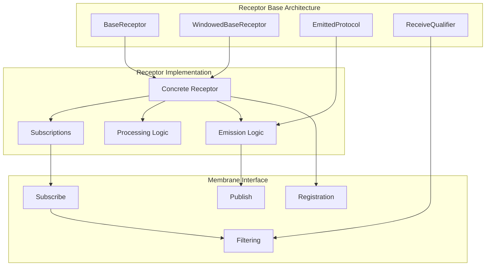
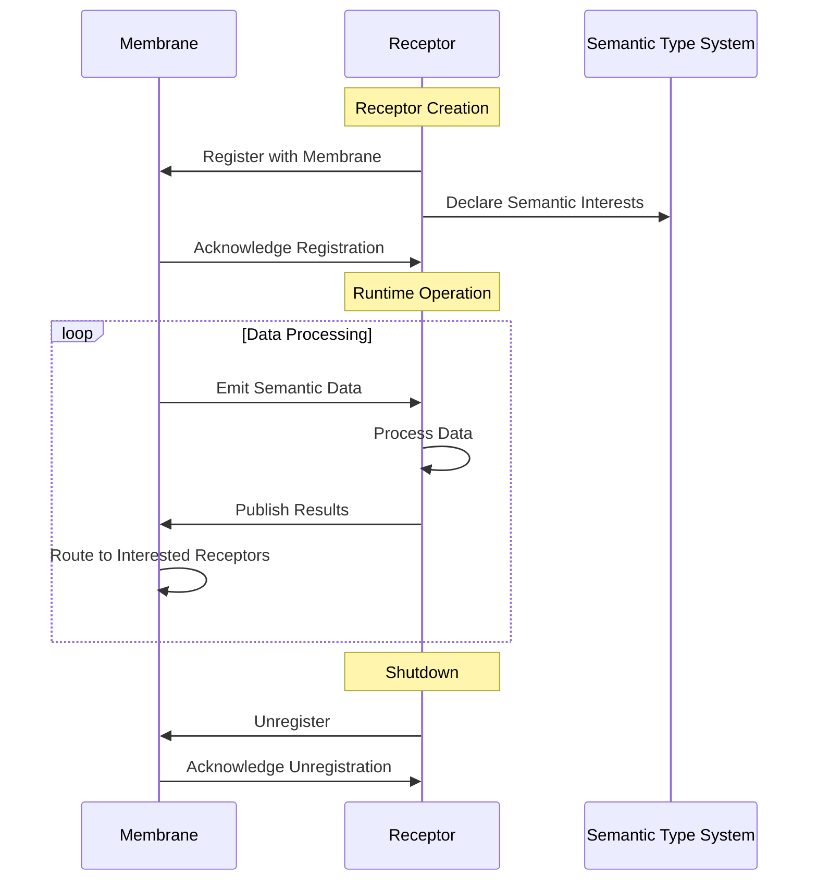
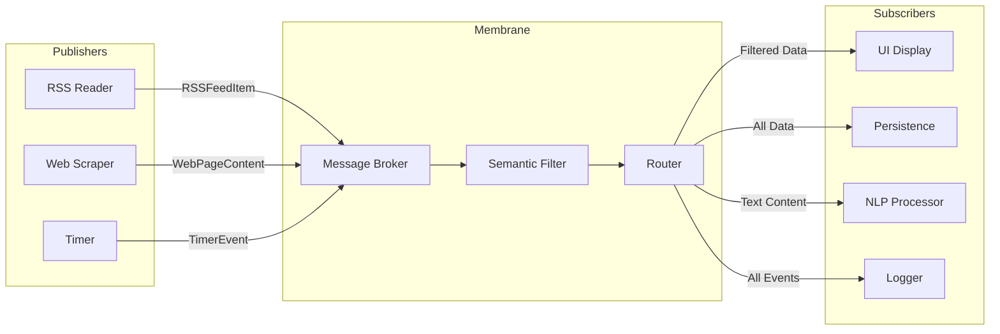
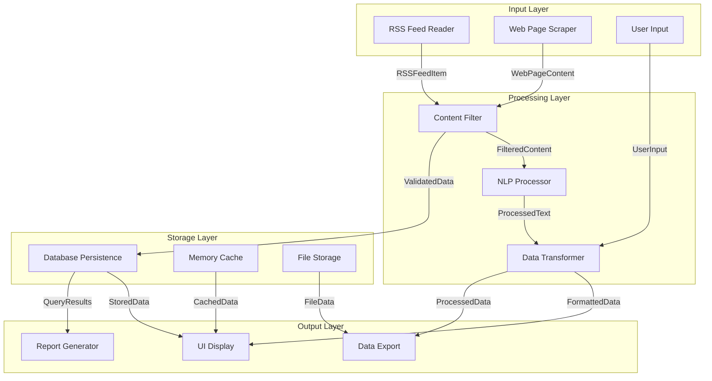
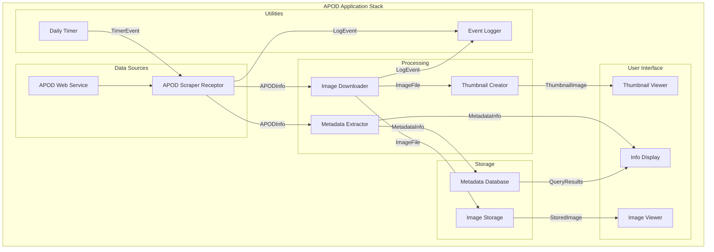
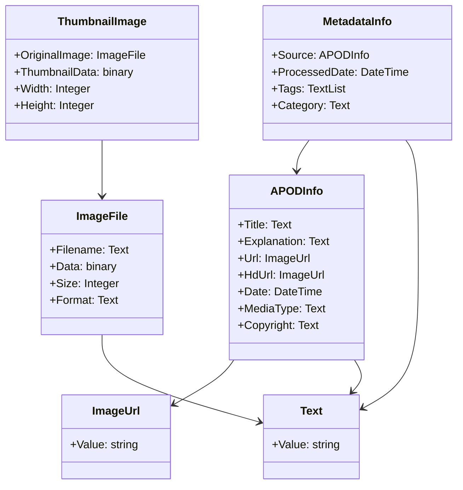

# HOPE Technical Architecture

## Table of Contents
- [Overview](#overview)
- [Core Concepts](#core-concepts)
- [System Architecture](#system-architecture)
- [Component Architecture](#component-architecture)
- [Semantic Type System](#semantic-type-system)
- [Receptor Architecture](#receptor-architecture)
- [Communication Patterns](#communication-patterns)
- [Application Stack](#application-stack)
- [Related Documentation](#related-documentation)

## Overview

The Higher Order Programming Environment (HOPE) is an architectural framework for implementing end-user processes as finite automata (FA) in a distributed computing space. The system enables building applications by composing "receptors" that communicate through semanticized data in a publish-subscribe pattern.

### Key Principles

- **Semantic-First Design**: All data is semantically typed, enabling rich meaning and automatic interconnection
- **Receptor-Based Components**: Applications are built from finite automata receptors that self-wire based on semantic interest
- **Emergent Architecture**: New computational stacks emerge from combining existing receptors with new semantic types
- **Dynamic Composition**: Receptors can be added, removed, or reconfigured at runtime

## Core Concepts



### Semantic Types
Structured data definitions that carry meaning beyond simple data types. Examples:
- `RSSFeedItem` containing `Title`, `Url`, `Description`, `PubDate`
- `WeatherInfo` containing `Temperature`, `Humidity`, `Location`
- `ImageInfo` containing `Filename`, `Dimensions`, `Format`

### Receptors
Self-contained computational units that:
- Subscribe to specific semantic types
- Process received data
- Emit new semantic types
- Can maintain internal state

### Membrane/Broker
Central communication hub that:
- Routes semantic data between receptors
- Manages receptor lifecycle
- Handles semantic type registration
- Provides filtering and transformation capabilities

## System Architecture



## Component Architecture



## Semantic Type System



### Semantic Type Example

```xml
<SemanticType Name="RSSFeedItem">
  <SemanticElement Name="RSSFeedName" UniqueKey="true">
    <SemanticElement Name="Text">
      <NativeType Name="Value" Type="string" />
    </SemanticElement>
  </SemanticElement>
  <SemanticElement Name="RSSFeedUrl" UniqueKey="true">
    <SemanticElement Name="Url">
      <NativeType Name="Value" Type="string" />
    </SemanticElement>
  </SemanticElement>
  <SemanticElement Name="RSSFeedTitle">
    <SemanticElement Name="Text">
      <NativeType Name="Value" Type="string" />
    </SemanticElement>
  </SemanticElement>
  <SemanticElement Name="RSSFeedDescription">
    <SemanticElement Name="Text">
      <NativeType Name="Value" Type="string" />
    </SemanticElement>
  </SemanticElement>
  <SemanticElement Name="RSSFeedPubDate">
    <NativeType Name="Value" Type="DateTime" />
  </SemanticElement>
</SemanticType>
```

## Receptor Architecture



### Receptor Lifecycle



## Communication Patterns

### Publish-Subscribe Pattern



### Semantic Data Flow



## Application Stack

### Example: APOD (Astronomy Picture of the Day) Application



### Semantic Types in APOD Application



## Related Documentation

- **[Semantic Type System](Semantic-Type-System.md)** - Detailed semantic type system architecture
- **[Receptor Architecture](Receptor-Architecture.md)** - In-depth receptor design patterns
- **[Data Flow](Data-Flow.md)** - Communication patterns and data routing
- **[Examples](Examples.md)** - Practical implementation examples
- **[Deployment](Deployment.md)** - Setup and deployment instructions

## External Resources

- [Main Project Repository](https://github.com/rzonedevops/HOPE)
- [HOPE Introduction Video](http://youtu.be/O1V4XSYYNxs)
- [APOD Scraper Demo](http://youtu.be/NdapAL2tt7w)
- [Membrane Computing Video](http://youtu.be/XoQSTJcrEj8)
- [CodeProject Articles](http://www.codeproject.com/Articles/777843/HOPE-Higher-Order-Programming-Environment)