# Data Flow and Communication Patterns

## Table of Contents
- [Overview](#overview)
- [Data Flow Architecture](#data-flow-architecture)
- [Communication Mechanisms](#communication-mechanisms)
- [Message Routing](#message-routing)
- [Data Transformation Patterns](#data-transformation-patterns)
- [Example Data Flows](#example-data-flows)
- [Performance Considerations](#performance-considerations)
- [Debugging and Monitoring](#debugging-and-monitoring)

## Overview

Data flow in HOPE follows a semantic publish-subscribe pattern where receptors communicate through semantically typed messages routed by a central membrane. This architecture enables loose coupling, dynamic composition, and emergent computational behavior.

## Data Flow Architecture

### High-Level Data Flow

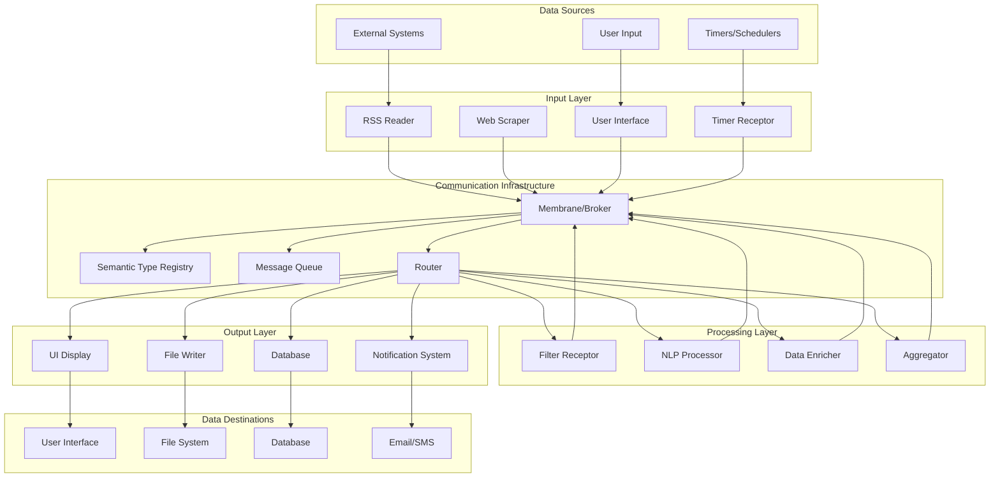

### Semantic Data Flow Layers

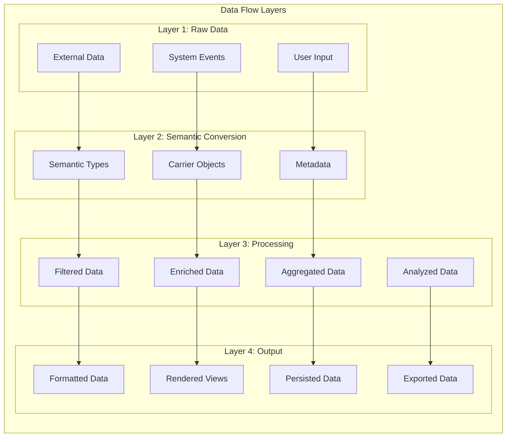

## Communication Mechanisms

### Publish-Subscribe Pattern

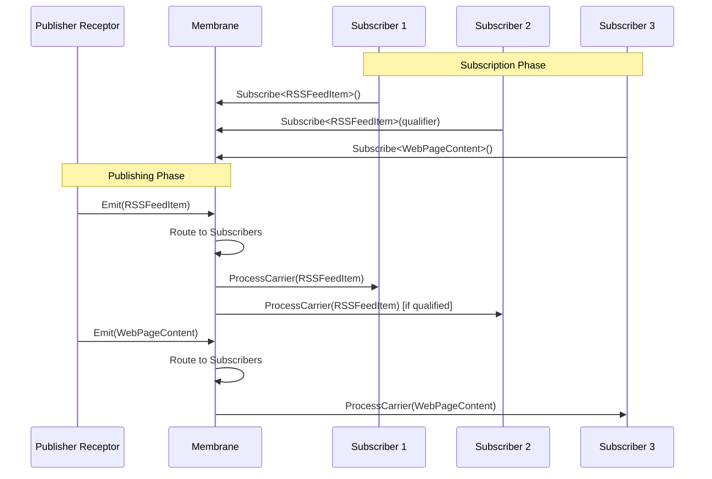

### Message Carrier Structure

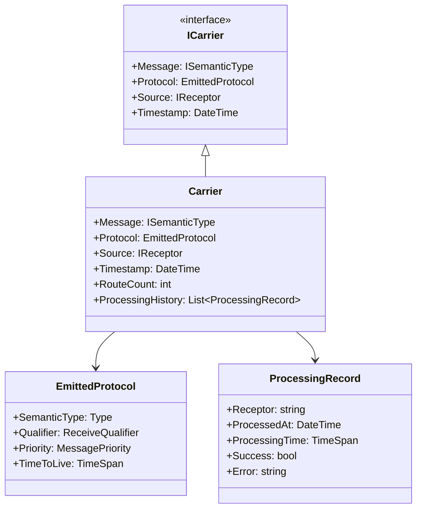

### Message Flow Through Membrane

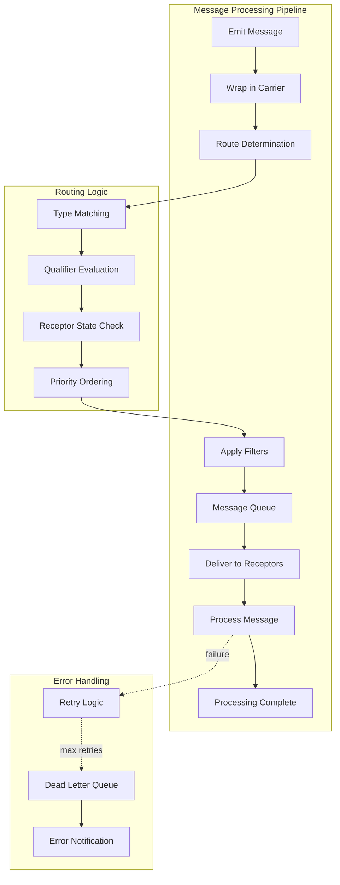

## Message Routing

### Routing Algorithms

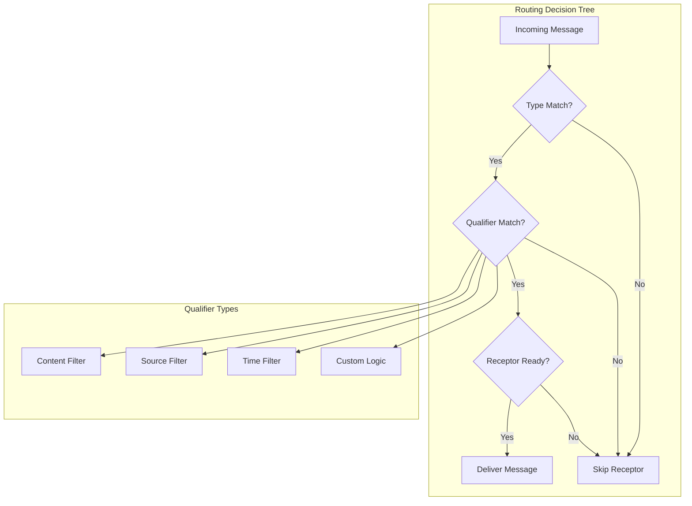

### Message Routing Example

```csharp
public class MessageRouter
{
    private Dictionary<Type, List<SubscriptionInfo>> subscriptions;
    
    public void RouteMessage(ICarrier carrier)
    {
        var messageType = carrier.Message.GetType();
        
        if (subscriptions.TryGetValue(messageType, out var subscribers))
        {
            foreach (var subscription in subscribers)
            {
                if (ShouldDeliver(carrier, subscription))
                {
                    DeliverMessage(carrier, subscription.Receptor);
                }
            }
        }
    }
    
    private bool ShouldDeliver(ICarrier carrier, SubscriptionInfo subscription)
    {
        // Type matching (already done)
        
        // Qualifier evaluation
        if (subscription.Qualifier != null)
        {
            return subscription.Qualifier.Evaluate(carrier);
        }
        
        // Receptor state check
        return subscription.Receptor.IsEnabled && 
               subscription.Receptor.CanReceive();
    }
}
```

## Data Transformation Patterns

### Linear Processing Chain

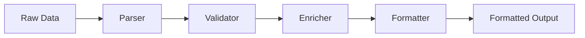

### Fan-Out Pattern

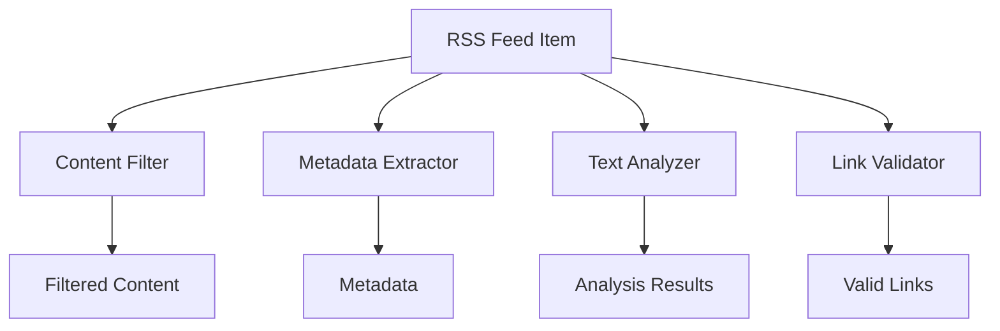

### Fan-In Pattern (Aggregation)

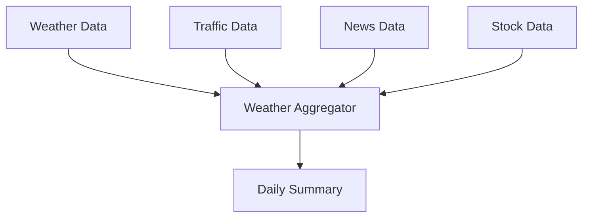

### Map-Reduce Pattern

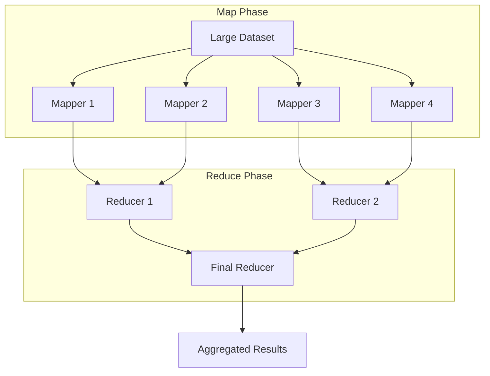

## Example Data Flows

### RSS Feed Processing Application

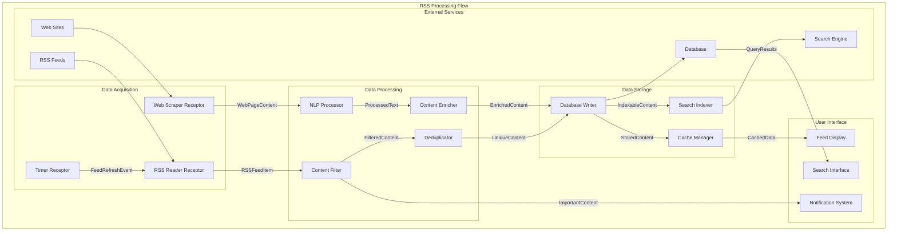

### Weather Information System

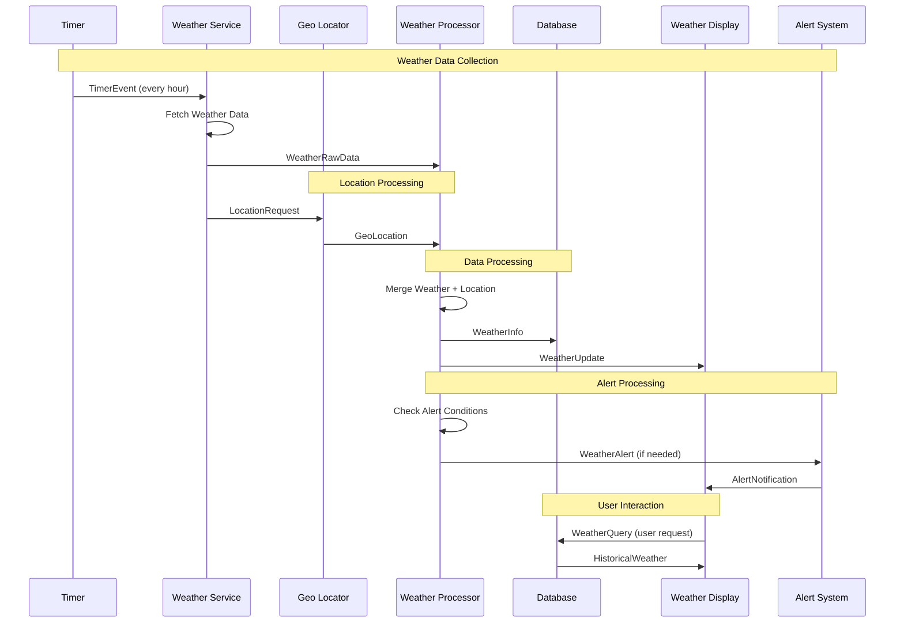

### Document Processing Workflow

```mermaid
graph TB
    subgraph "Document Processing Pipeline"
        subgraph "Input Sources"
            EMAIL[Email Receptor]
            FILE[File Watcher]
            UPLOAD[Upload Interface]
        end
        
        subgraph "Format Detection"
            DETECTOR[Format Detector]
            PDF_PROC[PDF Processor]
            DOC_PROC[Word Processor]
            TXT_PROC[Text Processor]
        end
        
        subgraph "Content Analysis"
            OCR[OCR Processor]
            TEXT_EXT[Text Extractor]
            META_EXT[Metadata Extractor]
            CLASSIFIER[Document Classifier]
        end
        
        subgraph "Data Enrichment"
            NLP_PROC[NLP Processor]
            ENTITY_EXT[Entity Extractor]
            SENTIMENT[Sentiment Analyzer]
            SUMMARIZER[Text Summarizer]
        end
        
        subgraph "Storage & Indexing"
            DOC_STORE[Document Store]
            SEARCH_IDX[Search Index]
            META_DB[Metadata Database]
            VERSION[Version Control]
        end
        
        subgraph "Output & Notification"
            WORKFLOW[Workflow Engine]
            NOTIFICATION[Notification System]
            REPORTS[Report Generator]
            API[REST API]
        end
    end
    
    EMAIL -->|EmailAttachment| DETECTOR
    FILE -->|FileInfo| DETECTOR
    UPLOAD -->|UploadedDocument| DETECTOR
    
    DETECTOR -->|PDFDocument| PDF_PROC
    DETECTOR -->|WordDocument| DOC_PROC
    DETECTOR -->|TextDocument| TXT_PROC
    
    PDF_PROC -->|ExtractedText| TEXT_EXT
    DOC_PROC -->|DocumentContent| META_EXT
    TXT_PROC -->|PlainText| CLASSIFIER
    
    OCR -->|OCRText| NLP_PROC
    TEXT_EXT -->|ProcessedText| ENTITY_EXT
    META_EXT -->|DocumentMetadata| SENTIMENT
    CLASSIFIER -->|DocumentCategory| SUMMARIZER
    
    NLP_PROC -->|ProcessedDocument| DOC_STORE
    ENTITY_EXT -->|ExtractedEntities| SEARCH_IDX
    SENTIMENT -->|SentimentData| META_DB
    SUMMARIZER -->|DocumentSummary| VERSION
    
    DOC_STORE -->|StoredDocument| WORKFLOW
    SEARCH_IDX -->|IndexedDocument| NOTIFICATION
    META_DB -->|DocumentMetadata| REPORTS
    VERSION -->|VersionInfo| API
```

## Performance Considerations

### Message Throughput Optimization

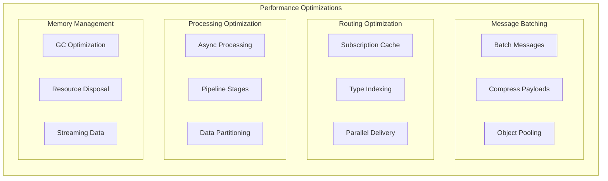

### Bottleneck Identification

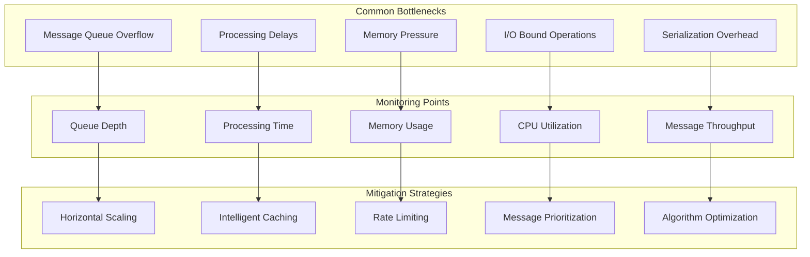

## Debugging and Monitoring

### Message Flow Tracing

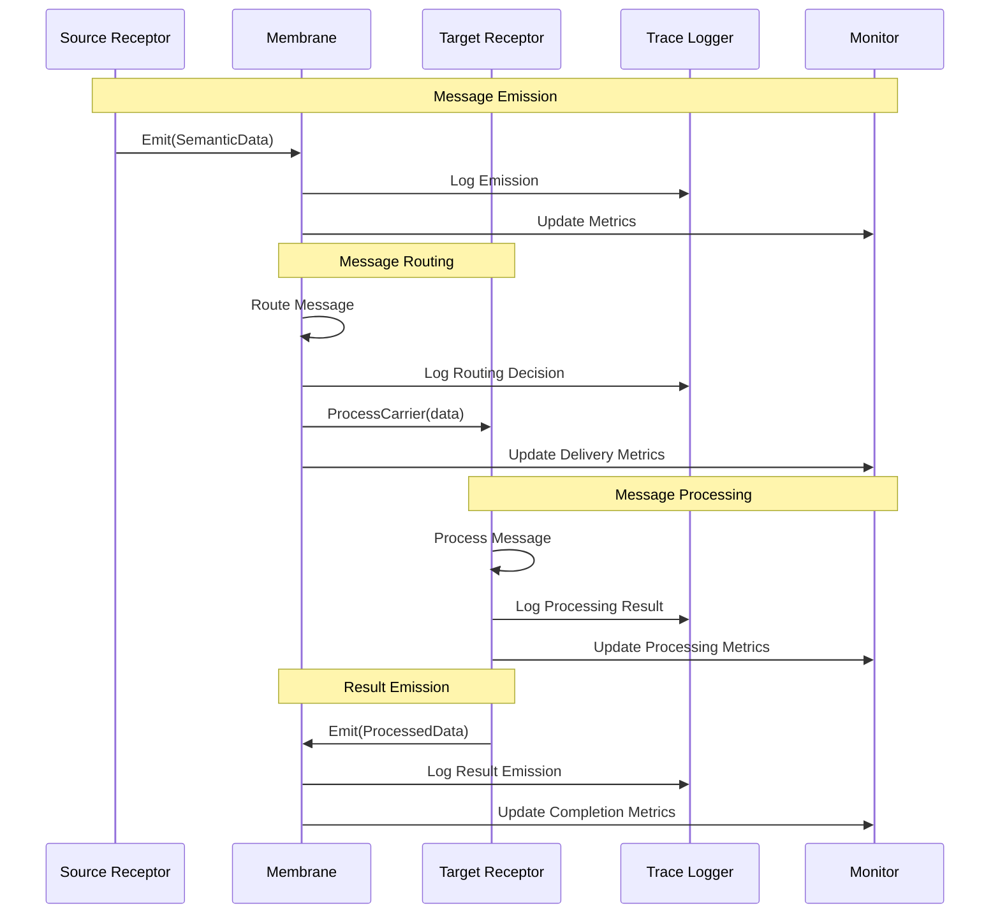

### Monitoring Infrastructure

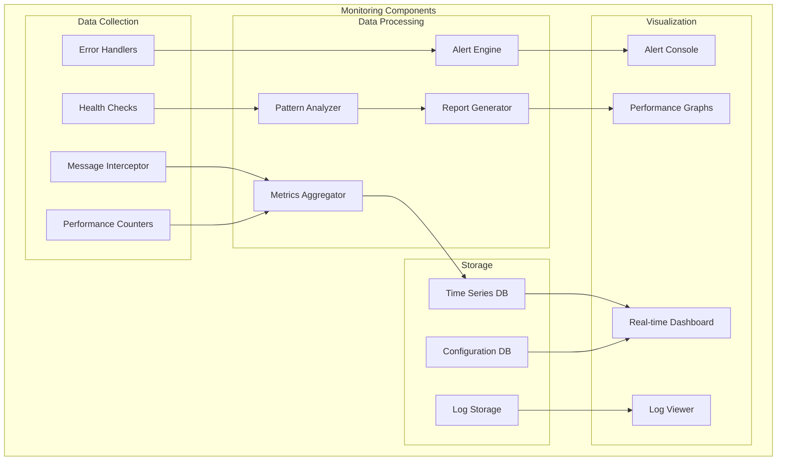

### Debug Information Flow

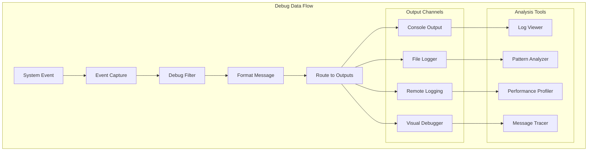

## Related Documentation

- **[ARCHITECTURE.md](ARCHITECTURE.md)** - Overall system architecture
- **[Semantic-Type-System.md](Semantic-Type-System.md)** - Understanding semantic data structures
- **[Receptor-Architecture.md](Receptor-Architecture.md)** - How receptors produce and consume data
- **[Examples.md](Examples.md)** - Practical examples of data flows in action