# Deployment and Setup Guide

## Table of Contents
- [Overview](#overview)
- [System Requirements](#system-requirements)
- [Development Environment Setup](#development-environment-setup)
- [Building the System](#building-the-system)
- [Deployment Architectures](#deployment-architectures)
- [Configuration Management](#configuration-management)
- [Monitoring and Logging](#monitoring-and-logging)
- [Troubleshooting](#troubleshooting)
- [Scaling Considerations](#scaling-considerations)

## Overview

This guide provides comprehensive instructions for setting up, building, and deploying HOPE applications. The system is designed to be flexible and can be deployed in various configurations, from single-machine development environments to distributed production systems.

## System Requirements

### Minimum Requirements

```mermaid
graph TB
    subgraph "Development Machine"
        subgraph "Software Requirements"
            NET[.NET Framework 4.5+]
            VS[Visual Studio 2012+]
            WIN[Windows 7+]
            IIS[IIS 7+ (optional)]
        end
        
        subgraph "Hardware Requirements"
            CPU[2+ Core CPU]
            RAM[4GB RAM]
            DISK[10GB Disk Space]
            NETWORK[Network Access]
        end
        
        subgraph "Optional Components"
            SQL[SQL Server/Express]
            OFFICE[Office/Word (for docs)]
            GIT[Git for Source Control]
        end
    end
```

### Recommended Production Requirements

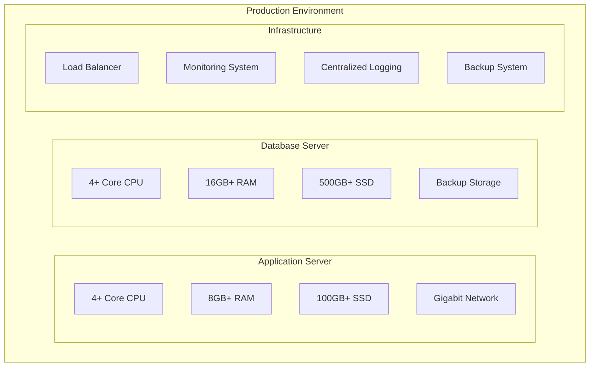

## Development Environment Setup

### Step 1: Install Prerequisites

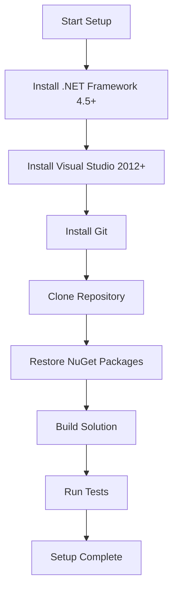

### Step 2: Clone and Build

```bash
# Clone the repository
git clone https://github.com/rzonedevops/HOPE.git
cd HOPE

# Restore NuGet packages (if using newer Visual Studio)
nuget restore TypeSystems.sln

# Build the solution
msbuild TypeSystems.sln /p:Configuration=Release

# Or use Visual Studio to build
# Open TypeSystems.sln in Visual Studio and build
```

### Step 3: Verify Installation

```csharp
// Create a simple test application
using Clifton.Receptor;
using Clifton.SemanticTypeSystem;

class Program
{
    static void Main(string[] args)
    {
        // Create a membrane
        var membrane = new Membrane();
        
        // Create a simple receptor
        var helloReceptor = new HelloWorldReceptor();
        membrane.RegisterReceptor(helloReceptor);
        
        // Initialize and test
        helloReceptor.Initialize();
        
        Console.WriteLine("HOPE system initialized successfully!");
        Console.ReadKey();
    }
}
```

## Building the System

### Build Configuration

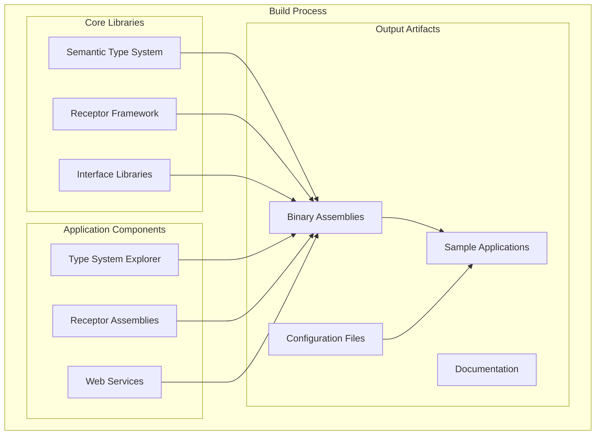

### Build Scripts

Create a build script for automated deployment:

```batch
@echo off
echo Building HOPE System...

REM Set environment variables
set MSBUILD="C:\Program Files (x86)\Microsoft Visual Studio\2019\Professional\MSBuild\Current\Bin\MSBuild.exe"
set SOLUTION=TypeSystems.sln
set CONFIG=Release

echo.
echo Cleaning previous build...
%MSBUILD% %SOLUTION% /t:Clean /p:Configuration=%CONFIG%

echo.
echo Restoring NuGet packages...
nuget restore %SOLUTION%

echo.
echo Building solution...
%MSBUILD% %SOLUTION% /t:Rebuild /p:Configuration=%CONFIG%

if %ERRORLEVEL% NEQ 0 (
    echo Build failed!
    exit /b 1
)

echo.
echo Copying output files...
xcopy /Y /S bin\%CONFIG%\*.dll deploy\bin\
xcopy /Y /S bin\%CONFIG%\*.exe deploy\bin\
xcopy /Y /S configs\*.xml deploy\configs\

echo.
echo Build completed successfully!
```

### Continuous Integration

```yaml
# GitHub Actions workflow example
name: HOPE Build and Test

on:
  push:
    branches: [ main, develop ]
  pull_request:
    branches: [ main ]

jobs:
  build:
    runs-on: windows-latest
    
    steps:
    - uses: actions/checkout@v2
    
    - name: Setup .NET Framework
      uses: microsoft/setup-msbuild@v1
      
    - name: Restore NuGet packages
      run: nuget restore TypeSystems.sln
      
    - name: Build solution
      run: msbuild TypeSystems.sln /p:Configuration=Release
      
    - name: Run tests
      run: |
        vstest.console.exe UnitTests\**\bin\Release\*.Tests.dll
        
    - name: Archive artifacts
      uses: actions/upload-artifact@v2
      with:
        name: HOPE-Build
        path: |
          bin/Release/
          !bin/Release/**/*.pdb
```

## Deployment Architectures

### Single Machine Deployment

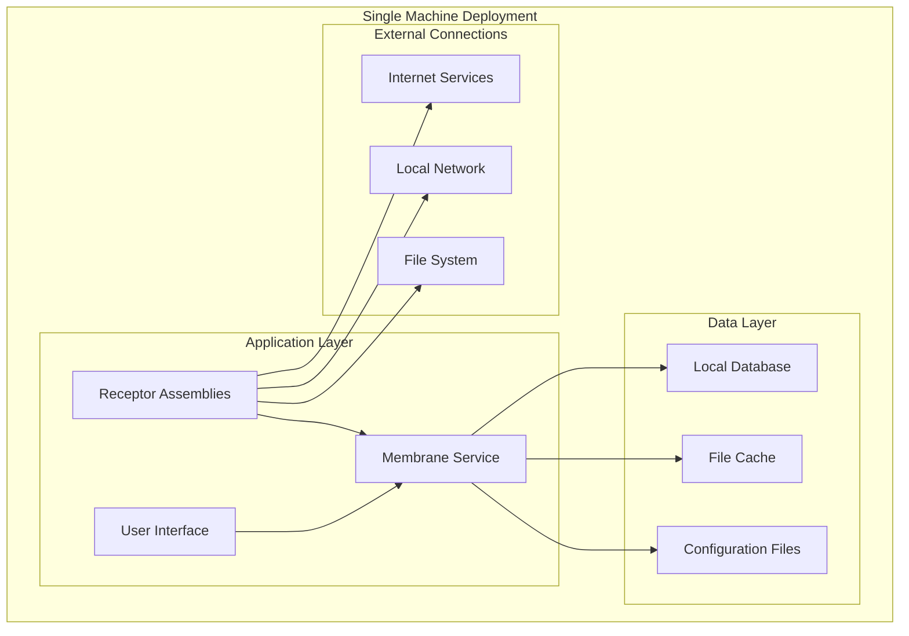

### Multi-Tier Deployment

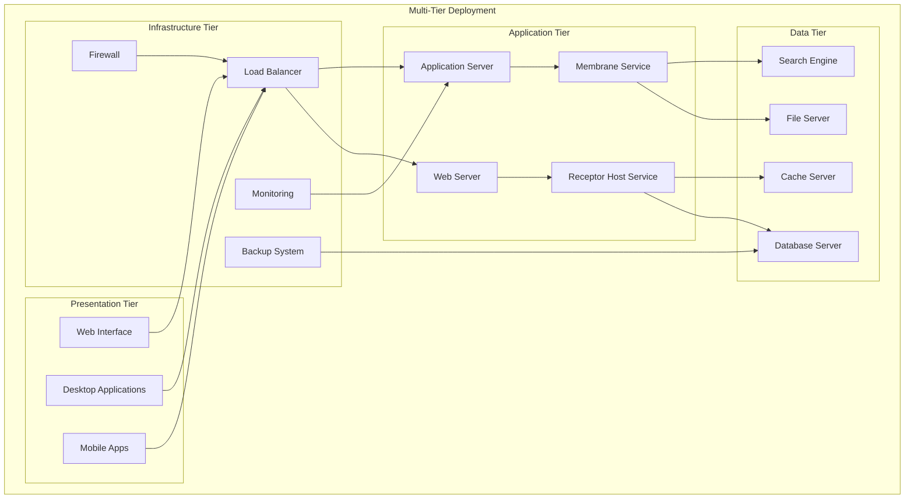

### Distributed Deployment

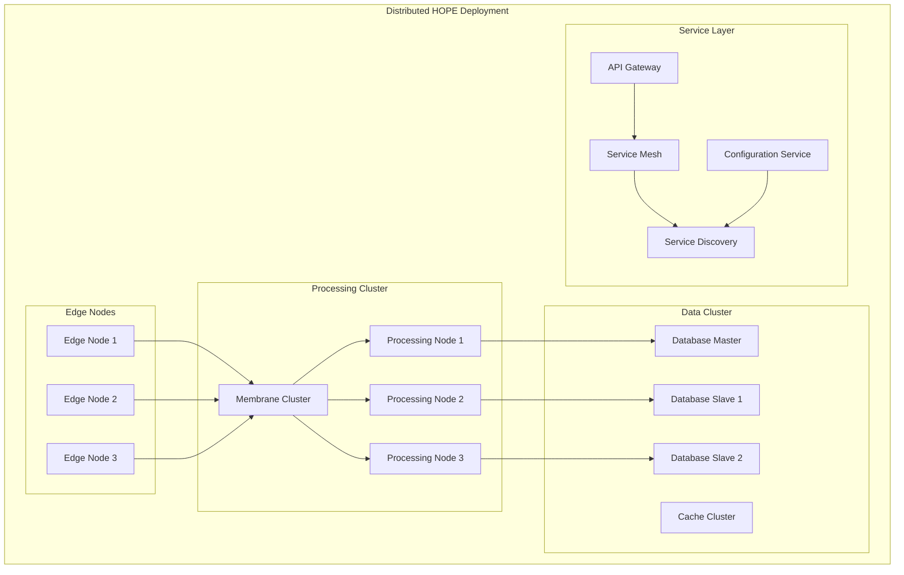

## Configuration Management

### Configuration Architecture

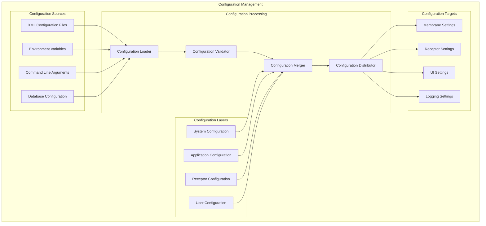

### Configuration Files

#### System Configuration (system.config.xml)
```xml
<?xml version="1.0" encoding="utf-8"?>
<SystemConfiguration>
  <Membrane>
    <MaxConcurrentMessages>1000</MaxConcurrentMessages>
    <MessageTimeout>30000</MessageTimeout>
    <EnablePerformanceCounters>true</EnablePerformanceCounters>
  </Membrane>
  
  <Logging>
    <LogLevel>Information</LogLevel>
    <LogPath>logs</LogPath>
    <MaxLogSize>100MB</MaxLogSize>
    <RotateDaily>true</RotateDaily>
  </Logging>
  
  <Database>
    <ConnectionString>Data Source=localhost;Initial Catalog=HOPE;Integrated Security=true</ConnectionString>
    <CommandTimeout>30</CommandTimeout>
    <PoolSize>100</PoolSize>
  </Database>
</SystemConfiguration>
```

#### Application Configuration (app.config.xml)
```xml
<?xml version="1.0" encoding="utf-8"?>
<ApplicationConfiguration>
  <SemanticTypes>
    <TypeDefinitionPath>types</TypeDefinitionPath>
    <AutoGenerateTypes>true</AutoGenerateTypes>
    <ValidateTypes>true</ValidateTypes>
  </SemanticTypes>
  
  <Receptors>
    <AutoDiscovery>true</AutoDiscovery>
    <ReceptorPath>receptors</ReceptorPath>
    <LoadOnStartup>
      <Receptor>LoggingReceptor</Receptor>
      <Receptor>PersistenceReceptor</Receptor>
    </LoadOnStartup>
  </Receptors>
  
  <Security>
    <EnableSecurity>false</EnableSecurity>
    <AuthenticationProvider>Windows</AuthenticationProvider>
    <AuthorizationProvider>Role</AuthorizationProvider>
  </Security>
</ApplicationConfiguration>
```

### Environment-Specific Configuration

```csharp
public class ConfigurationManager
{
    private Dictionary<string, object> configuration;
    
    public void LoadConfiguration()
    {
        // Load base configuration
        LoadFromFile("system.config.xml");
        LoadFromFile("app.config.xml");
        
        // Override with environment-specific settings
        var environment = Environment.GetEnvironmentVariable("HOPE_ENVIRONMENT") ?? "Development";
        LoadFromFile($"app.{environment}.config.xml");
        
        // Override with environment variables
        LoadFromEnvironmentVariables();
        
        // Override with command line arguments
        LoadFromCommandLineArguments();
        
        // Validate configuration
        ValidateConfiguration();
    }
    
    private void LoadFromEnvironmentVariables()
    {
        foreach (DictionaryEntry env in Environment.GetEnvironmentVariables())
        {
            var key = env.Key.ToString();
            if (key.StartsWith("HOPE_"))
            {
                var configKey = key.Substring(5).Replace("_", ".");
                configuration[configKey] = env.Value;
            }
        }
    }
}
```

## Monitoring and Logging

### Monitoring Architecture

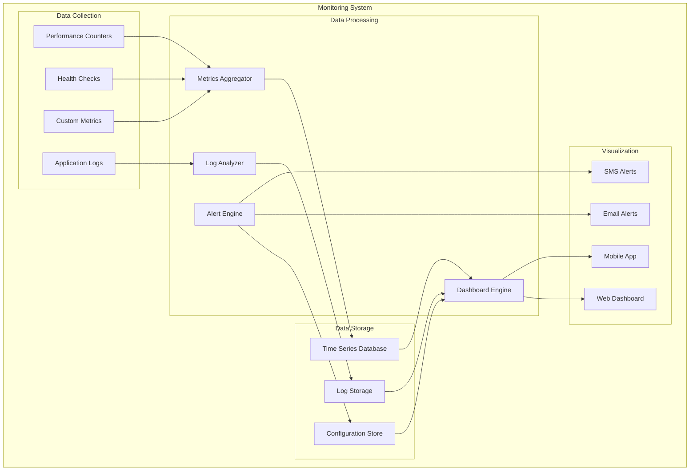

### Logging Configuration

```xml
<!-- Logging Configuration -->
<log4net>
  <appender name="FileAppender" type="log4net.Appender.RollingFileAppender">
    <file value="logs/hope.log" />
    <appendToFile value="true" />
    <rollingStyle value="Date" />
    <datePattern value="yyyyMMdd" />
    <maxSizeRollBackups value="10" />
    <layout type="log4net.Layout.PatternLayout">
      <conversionPattern value="%date [%thread] %-5level %logger - %message%newline" />
    </layout>
  </appender>
  
  <appender name="EventLogAppender" type="log4net.Appender.EventLogAppender">
    <applicationName value="HOPE" />
    <layout type="log4net.Layout.PatternLayout">
      <conversionPattern value="%date [%thread] %-5level %logger - %message" />
    </layout>
    <filter type="log4net.Filter.LevelRangeFilter">
      <levelMin value="WARN" />
    </filter>
  </appender>
  
  <appender name="DatabaseAppender" type="log4net.Appender.AdoNetAppender">
    <connectionType value="System.Data.SqlClient.SqlConnection, System.Data" />
    <connectionString value="data source=localhost;initial catalog=HOPE;integrated security=true;" />
    <commandText value="INSERT INTO Logs ([Date],[Thread],[Level],[Logger],[Message]) VALUES (@log_date, @thread, @log_level, @logger, @message)" />
    <parameter>
      <parameterName value="@log_date" />
      <dbType value="DateTime" />
      <layout type="log4net.Layout.RawTimeStampLayout" />
    </parameter>
    <parameter>
      <parameterName value="@thread" />
      <dbType value="String" />
      <size value="255" />
      <layout type="log4net.Layout.PatternLayout">
        <conversionPattern value="%thread" />
      </layout>
    </parameter>
    <parameter>
      <parameterName value="@log_level" />
      <dbType value="String" />
      <size value="50" />
      <layout type="log4net.Layout.PatternLayout">
        <conversionPattern value="%level" />
      </layout>
    </parameter>
    <parameter>
      <parameterName value="@logger" />
      <dbType value="String" />
      <size value="255" />
      <layout type="log4net.Layout.PatternLayout">
        <conversionPattern value="%logger" />
      </layout>
    </parameter>
    <parameter>
      <parameterName value="@message" />
      <dbType value="String" />
      <size value="4000" />
      <layout type="log4net.Layout.PatternLayout">
        <conversionPattern value="%message" />
      </layout>
    </parameter>
  </appender>
  
  <root>
    <level value="INFO" />
    <appender-ref ref="FileAppender" />
    <appender-ref ref="EventLogAppender" />
    <appender-ref ref="DatabaseAppender" />
  </root>
</log4net>
```

### Performance Monitoring

```csharp
public class PerformanceMonitor
{
    private PerformanceCounter messagesThroughput;
    private PerformanceCounter memoryUsage;
    private PerformanceCounter cpuUsage;
    
    public void Initialize()
    {
        // Create custom performance counters
        messagesThroughput = new PerformanceCounter(
            "HOPE Application", 
            "Messages Per Second", 
            false);
            
        memoryUsage = new PerformanceCounter(
            "Memory", 
            "Available MBytes");
            
        cpuUsage = new PerformanceCounter(
            "Processor", 
            "% Processor Time", 
            "_Total");
    }
    
    public void RecordMessageProcessed()
    {
        messagesThroughput.Increment();
    }
    
    public SystemMetrics GetSystemMetrics()
    {
        return new SystemMetrics
        {
            MessageThroughput = messagesThroughput.NextValue(),
            MemoryUsageMB = memoryUsage.NextValue(),
            CpuUsagePercent = cpuUsage.NextValue(),
            Timestamp = DateTime.Now
        };
    }
}
```

## Troubleshooting

### Common Issues and Solutions

```mermaid
graph TB
    subgraph "Common Issues"
        subgraph "Build Issues"
            BUILD_FAIL[Build Failures]
            MISSING_DEPS[Missing Dependencies]
            VERSION_CONFLICT[Version Conflicts]
        end
        
        subgraph "Runtime Issues"
            RECEPTOR_FAIL[Receptor Failures]
            MEMORY_LEAK[Memory Leaks]
            PERF_ISSUE[Performance Issues]
            DEADLOCK[Deadlocks]
        end
        
        subgraph "Configuration Issues"
            INVALID_CONFIG[Invalid Configuration]
            MISSING_FILES[Missing Files]
            PERMISSION[Permission Issues]
        end
        
        subgraph "Integration Issues"
            DB_CONNECTION[Database Connection]
            SERVICE_UNAVAIL[Service Unavailable]
            NETWORK[Network Issues]
        end
    end
    
    subgraph "Diagnostic Tools"
        LOGS[Log Analysis]
        PROFILER[Performance Profiler]
        DEBUGGER[Visual Debugger]
        MONITOR[System Monitor]
    end
    
    BUILD_FAIL --> LOGS
    MISSING_DEPS --> LOGS
    VERSION_CONFLICT --> LOGS
    
    RECEPTOR_FAIL --> DEBUGGER
    MEMORY_LEAK --> PROFILER
    PERF_ISSUE --> MONITOR
    DEADLOCK --> DEBUGGER
    
    INVALID_CONFIG --> LOGS
    MISSING_FILES --> LOGS
    PERMISSION --> MONITOR
    
    DB_CONNECTION --> LOGS
    SERVICE_UNAVAIL --> MONITOR
    NETWORK --> LOGS
```

### Diagnostic Procedures

#### Memory Leak Detection

```csharp
public class MemoryDiagnostics
{
    private Timer diagnosticTimer;
    private long baselineMemory;
    
    public void StartMonitoring()
    {
        baselineMemory = GC.GetTotalMemory(true);
        diagnosticTimer = new Timer(CheckMemoryUsage, null, 
            TimeSpan.FromMinutes(1), TimeSpan.FromMinutes(1));
    }
    
    private void CheckMemoryUsage(object state)
    {
        var currentMemory = GC.GetTotalMemory(false);
        var memoryIncrease = currentMemory - baselineMemory;
        
        if (memoryIncrease > 50 * 1024 * 1024) // 50MB increase
        {
            // Force garbage collection
            GC.Collect();
            GC.WaitForPendingFinalizers();
            GC.Collect();
            
            var postGCMemory = GC.GetTotalMemory(true);
            var leakIndicator = postGCMemory - baselineMemory;
            
            if (leakIndicator > 20 * 1024 * 1024) // 20MB after GC
            {
                LogWarning($"Potential memory leak detected: {leakIndicator / 1024 / 1024}MB");
                DumpMemoryStatistics();
            }
        }
    }
    
    private void DumpMemoryStatistics()
    {
        // Log memory statistics for analysis
        var gen0 = GC.CollectionCount(0);
        var gen1 = GC.CollectionCount(1);
        var gen2 = GC.CollectionCount(2);
        
        LogInfo($"GC Collections - Gen0: {gen0}, Gen1: {gen1}, Gen2: {gen2}");
        
        // Additional memory analysis...
    }
}
```

#### Performance Diagnostics

```csharp
public class PerformanceDiagnostics
{
    private ConcurrentDictionary<string, PerformanceMetrics> receptorMetrics;
    
    public void RecordReceptorPerformance(string receptorName, TimeSpan processingTime)
    {
        receptorMetrics.AddOrUpdate(receptorName, 
            new PerformanceMetrics(processingTime),
            (key, existing) => existing.AddSample(processingTime));
    }
    
    public void GeneratePerformanceReport()
    {
        var report = new StringBuilder();
        report.AppendLine("Receptor Performance Report");
        report.AppendLine("========================");
        
        foreach (var kvp in receptorMetrics.OrderByDescending(x => x.Value.AverageTime))
        {
            var metrics = kvp.Value;
            report.AppendLine($"{kvp.Key}:");
            report.AppendLine($"  Average: {metrics.AverageTime.TotalMilliseconds:F2}ms");
            report.AppendLine($"  Min: {metrics.MinTime.TotalMilliseconds:F2}ms");
            report.AppendLine($"  Max: {metrics.MaxTime.TotalMilliseconds:F2}ms");
            report.AppendLine($"  Samples: {metrics.SampleCount}");
            report.AppendLine();
        }
        
        LogInfo(report.ToString());
    }
}
```

## Scaling Considerations

### Horizontal Scaling

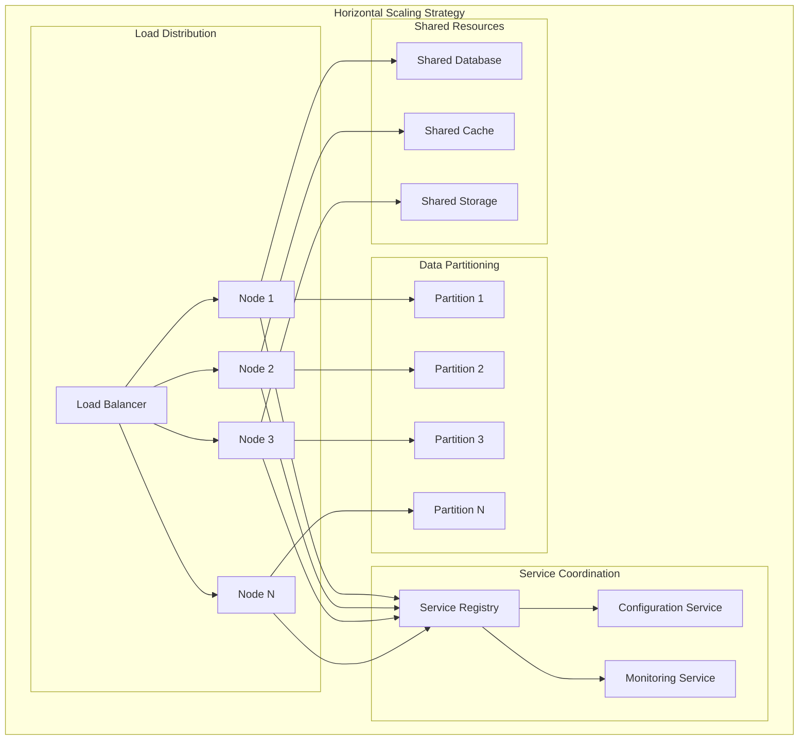

### Vertical Scaling

```mermaid
graph LR
    subgraph "Vertical Scaling Options"
        subgraph "CPU Scaling"
            CPU_2[2 Cores]
            CPU_4[4 Cores]
            CPU_8[8 Cores]
            CPU_16[16 Cores]
        end
        
        subgraph "Memory Scaling"
            MEM_4[4GB RAM]
            MEM_8[8GB RAM]
            MEM_16[16GB RAM]
            MEM_32[32GB RAM]
        end
        
        subgraph "Storage Scaling"
            HDD[HDD Storage]
            SSD[SSD Storage]
            NVME[NVMe Storage]
            RAM_DISK[RAM Disk]
        end
        
        subgraph "Network Scaling"
            NET_100[100 Mbps]
            NET_1G[1 Gbps]
            NET_10G[10 Gbps]
            NET_40G[40 Gbps]
        end
    end
    
    CPU_2 --> CPU_4
    CPU_4 --> CPU_8
    CPU_8 --> CPU_16
    
    MEM_4 --> MEM_8
    MEM_8 --> MEM_16
    MEM_16 --> MEM_32
    
    HDD --> SSD
    SSD --> NVME
    NVME --> RAM_DISK
    
    NET_100 --> NET_1G
    NET_1G --> NET_10G
    NET_10G --> NET_40G
```

### Performance Optimization

```csharp
public class ScalingOptimizations
{
    // Optimize message batching
    public void OptimizeMessageBatching()
    {
        var batchProcessor = new BatchMessageProcessor
        {
            BatchSize = 100,
            BatchTimeout = TimeSpan.FromMilliseconds(100),
            MaxConcurrentBatches = Environment.ProcessorCount * 2
        };
    }
    
    // Optimize memory usage
    public void OptimizeMemoryUsage()
    {
        // Use object pooling for frequently created objects
        var objectPool = new ObjectPool<SemanticTypeInstance>(
            () => new SemanticTypeInstance(),
            instance => instance.Reset(),
            Environment.ProcessorCount * 10);
            
        // Configure garbage collection
        GCSettings.LatencyMode = GCLatencyMode.Batch;
        GCSettings.LargeObjectHeapCompactionMode = GCLargeObjectHeapCompactionMode.CompactOnce;
    }
    
    // Optimize database access
    public void OptimizeDatabaseAccess()
    {
        var connectionPool = new ConnectionPool
        {
            MinConnections = 5,
            MaxConnections = 50,
            ConnectionTimeout = TimeSpan.FromSeconds(30),
            IdleTimeout = TimeSpan.FromMinutes(5)
        };
        
        // Use connection multiplexing
        var multiplexer = new ConnectionMultiplexer(connectionPool);
    }
}
```

## Related Documentation

- **[ARCHITECTURE.md](ARCHITECTURE.md)** - Overall system architecture
- **[Semantic-Type-System.md](Semantic-Type-System.md)** - Understanding the semantic type system
- **[Receptor-Architecture.md](Receptor-Architecture.md)** - Receptor design and implementation
- **[Data-Flow.md](Data-Flow.md)** - Understanding data flow and communication
- **[Examples.md](Examples.md)** - Practical implementation examples

## External Resources

- [.NET Framework Download](https://dotnet.microsoft.com/download/dotnet-framework)
- [Visual Studio Download](https://visualstudio.microsoft.com/downloads/)
- [SQL Server Express](https://www.microsoft.com/en-us/sql-server/sql-server-downloads)
- [Git for Windows](https://git-scm.com/download/win)