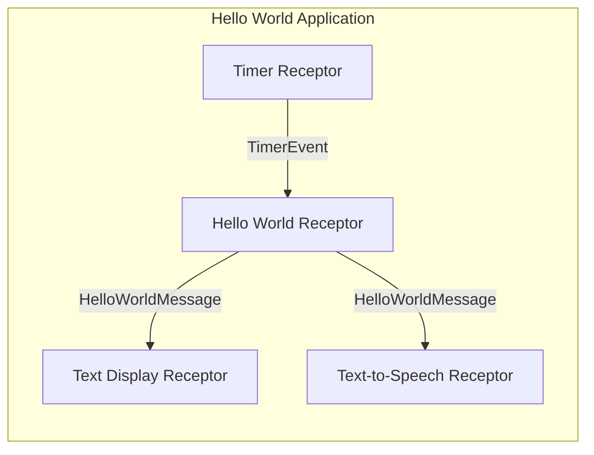
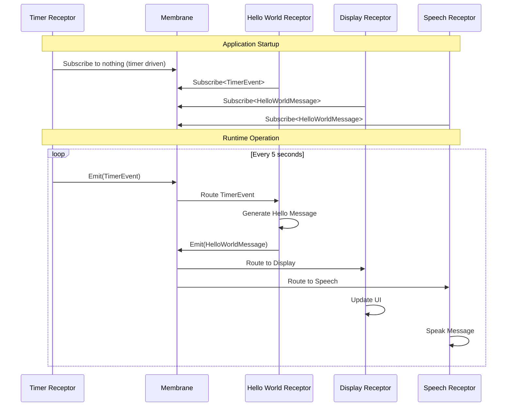
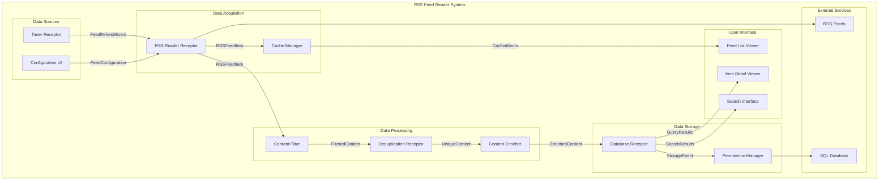
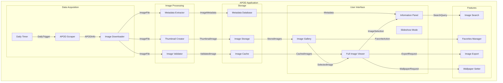
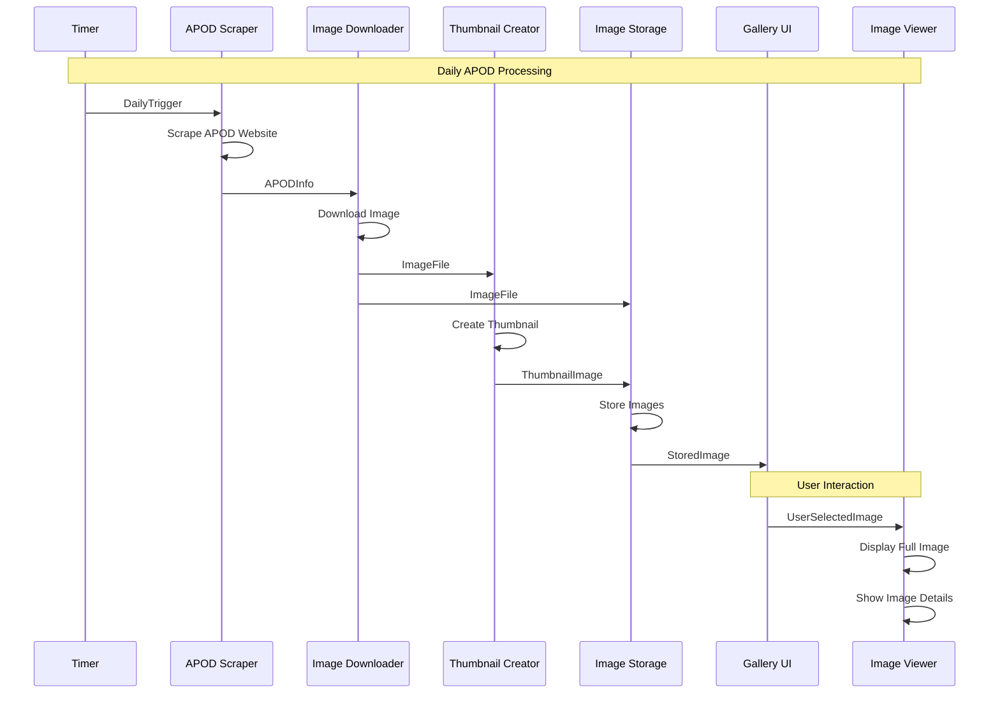
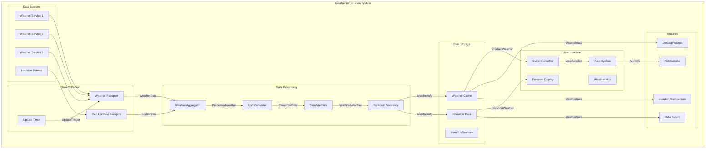
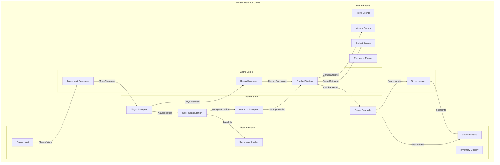
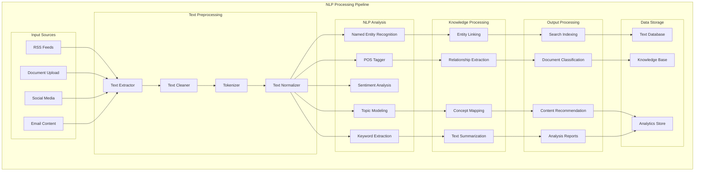
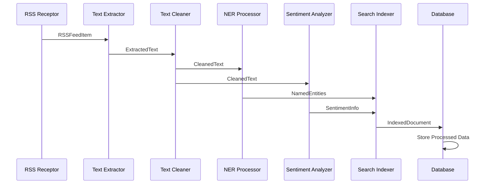

# Practical Examples and Use Cases

## Table of Contents
- [Overview](#overview)
- [Hello World Example](#hello-world-example)
- [RSS Feed Reader Application](#rss-feed-reader-application)
- [APOD (Astronomy Picture of the Day) Application](#apod-astronomy-picture-of-the-day-application)
- [Weather Information System](#weather-information-system)
- [Hunt the Wumpus Game](#hunt-the-wumpus-game)
- [Natural Language Processing Pipeline](#natural-language-processing-pipeline)
- [Building Custom Applications](#building-custom-applications)
- [Best Practices from Examples](#best-practices-from-examples)

## Overview

This document provides practical examples of HOPE applications, from simple Hello World scenarios to complex multi-receptor systems. Each example demonstrates key architectural patterns and shows how semantic types and receptors work together to create emergent functionality.

## Hello World Example

The Hello World example demonstrates the basic receptor communication pattern.

### Application Architecture



### Semantic Types

```xml
<!-- Timer Event -->
<SemanticType Name="TimerEvent">
  <SemanticElement Name="EventTime">
    <NativeType Name="Value" Type="DateTime" />
  </SemanticElement>
  <SemanticElement Name="Interval">
    <NativeType Name="Value" Type="TimeSpan" />
  </SemanticElement>
</SemanticType>

<!-- Hello World Message -->
<SemanticType Name="HelloWorldMessage">
  <SemanticElement Name="Message">
    <SemanticElement Name="Text">
      <NativeType Name="Value" Type="string" />
    </SemanticElement>
  </SemanticElement>
  <SemanticElement Name="Timestamp">
    <NativeType Name="Value" Type="DateTime" />
  </SemanticElement>
</SemanticType>
```

### Receptor Implementation

```csharp
public class HelloWorldReceptor : BaseReceptor
{
    private int messageCount = 0;
    
    public override void Initialize()
    {
        Subscribe<TimerEvent>();
    }
    
    protected override void ProcessMessage(ICarrier carrier)
    {
        if (carrier.Message is TimerEvent timerEvent)
        {
            messageCount++;
            
            var message = new HelloWorldMessage();
            message.Message.Text.Value = $"Hello World #{messageCount} at {DateTime.Now}";
            message.Timestamp.Value = DateTime.Now;
            
            Emit(message);
        }
    }
}

public class TextDisplayReceptor : WindowedBaseReceptor
{
    private ListBox messageList;
    
    public override void Initialize()
    {
        Subscribe<HelloWorldMessage>();
        CreateForm();
    }
    
    protected override void CreateForm()
    {
        Form = new Form { Text = "Hello World Display", Size = new Size(400, 300) };
        messageList = new ListBox { Dock = DockStyle.Fill };
        Form.Controls.Add(messageList);
        ShowForm();
    }
    
    protected override void ProcessMessage(ICarrier carrier)
    {
        if (carrier.Message is HelloWorldMessage message)
        {
            if (Form.InvokeRequired)
            {
                Form.Invoke(new Action(() => AddMessage(message)));
            }
            else
            {
                AddMessage(message);
            }
        }
    }
    
    private void AddMessage(HelloWorldMessage message)
    {
        messageList.Items.Add(message.Message.Text.Value);
        messageList.SelectedIndex = messageList.Items.Count - 1;
    }
}
```

### Data Flow Sequence



## RSS Feed Reader Application

A more complex application that demonstrates data processing pipelines and multiple receptor types.

### Application Architecture



### Key Semantic Types

```xml
<!-- RSS Feed Configuration -->
<SemanticType Name="RSSFeedConfiguration">
  <SemanticElement Name="FeedUrl">
    <SemanticElement Name="Url">
      <NativeType Name="Value" Type="string" />
    </SemanticElement>
  </SemanticElement>
  <SemanticElement Name="RefreshInterval">
    <NativeType Name="Value" Type="TimeSpan" />
  </SemanticElement>
  <SemanticElement Name="FilterKeywords">
    <SemanticElement Name="TextList">
      <NativeType Name="Values" Type="List&lt;string&gt;" />
    </SemanticElement>
  </SemanticElement>
</SemanticType>

<!-- RSS Feed Item -->
<SemanticType Name="RSSFeedItem">
  <SemanticElement Name="RSSFeedName" UniqueKey="true" Normalized="true">
    <SemanticElement Name="Text">
      <NativeType Name="Value" Type="string" />
    </SemanticElement>
  </SemanticElement>
  <SemanticElement Name="RSSFeedUrl" UniqueKey="true" Normalized="true">
    <SemanticElement Name="Url">
      <NativeType Name="Value" Type="string" />
    </SemanticElement>
  </SemanticElement>
  <SemanticElement Name="RSSFeedTitle">
    <SemanticElement Name="Text">
      <NativeType Name="Value" Type="string" />
    </SemanticElement>
  </SemanticElement>
  <SemanticElement Name="RSSFeedDescription">
    <SemanticElement Name="Text">
      <NativeType Name="Value" Type="string" />
    </SemanticElement>
  </SemanticElement>
  <SemanticElement Name="RSSFeedPubDate">
    <NativeType Name="Value" Type="DateTime" />
  </SemanticElement>
</SemanticType>

<!-- Filtered Content -->
<SemanticType Name="FilteredContent">
  <SemanticElement Name="OriginalItem">
    <SemanticElement Name="RSSFeedItem" />
  </SemanticElement>
  <SemanticElement Name="FilterReason">
    <SemanticElement Name="Text">
      <NativeType Name="Value" Type="string" />
    </SemanticElement>
  </SemanticElement>
  <SemanticElement Name="FilteredAt">
    <NativeType Name="Value" Type="DateTime" />
  </SemanticElement>
</SemanticType>
```

### RSS Reader Receptor Implementation

```csharp
public class RSSReaderReceptor : BaseReceptor
{
    private Timer refreshTimer;
    private List<string> feedUrls = new List<string>();
    private TimeSpan refreshInterval = TimeSpan.FromMinutes(15);
    
    public override void Initialize()
    {
        Subscribe<RSSFeedConfiguration>();
        Subscribe<FeedRefreshEvent>();
        
        // Start with default refresh timer
        StartRefreshTimer();
    }
    
    protected override void ProcessMessage(ICarrier carrier)
    {
        switch (carrier.Message)
        {
            case RSSFeedConfiguration config:
                HandleConfiguration(config);
                break;
                
            case FeedRefreshEvent refreshEvent:
                RefreshFeeds();
                break;
        }
    }
    
    private void HandleConfiguration(RSSFeedConfiguration config)
    {
        feedUrls.Add(config.FeedUrl.Url.Value);
        refreshInterval = config.RefreshInterval.Value;
        
        // Restart timer with new interval
        StopRefreshTimer();
        StartRefreshTimer();
        
        // Immediate refresh for new feed
        RefreshSingleFeed(config.FeedUrl.Url.Value);
    }
    
    private void RefreshFeeds()
    {
        foreach (var feedUrl in feedUrls)
        {
            RefreshSingleFeed(feedUrl);
        }
    }
    
    private void RefreshSingleFeed(string feedUrl)
    {
        try
        {
            var rssDocument = LoadRSSFeed(feedUrl);
            var feedName = ExtractFeedName(rssDocument);
            
            foreach (var item in rssDocument.Items)
            {
                var rssItem = new RSSFeedItem();
                rssItem.RSSFeedName.Text.Value = feedName;
                rssItem.RSSFeedUrl.Url.Value = item.Link;
                rssItem.RSSFeedTitle.Text.Value = item.Title;
                rssItem.RSSFeedDescription.Text.Value = item.Description;
                rssItem.RSSFeedPubDate.Value = item.PublishDate;
                
                Emit(rssItem);
            }
            
            Emit(new FeedRefreshCompleted
            {
                FeedUrl = feedUrl,
                ItemCount = rssDocument.Items.Count,
                RefreshedAt = DateTime.Now
            });
        }
        catch (Exception ex)
        {
            Emit(new FeedRefreshError
            {
                FeedUrl = feedUrl,
                ErrorMessage = ex.Message,
                ErrorTime = DateTime.Now
            });
        }
    }
}
```

## APOD (Astronomy Picture of the Day) Application

This example demonstrates image processing, web scraping, and UI integration.

### Application Components



### APOD Semantic Types

```xml
<SemanticType Name="APODInfo">
  <SemanticElement Name="Title">
    <SemanticElement Name="Text">
      <NativeType Name="Value" Type="string" />
    </SemanticElement>
  </SemanticElement>
  <SemanticElement Name="Explanation">
    <SemanticElement Name="Text">
      <NativeType Name="Value" Type="string" />
    </SemanticElement>
  </SemanticElement>
  <SemanticElement Name="ImageUrl">
    <SemanticElement Name="Url">
      <NativeType Name="Value" Type="string" />
    </SemanticElement>
  </SemanticElement>
  <SemanticElement Name="HighDefUrl">
    <SemanticElement Name="Url">
      <NativeType Name="Value" Type="string" />
    </SemanticElement>
  </SemanticElement>
  <SemanticElement Name="Date">
    <NativeType Name="Value" Type="DateTime" />
  </SemanticElement>
  <SemanticElement Name="MediaType">
    <SemanticElement Name="Text">
      <NativeType Name="Value" Type="string" />
    </SemanticElement>
  </SemanticElement>
  <SemanticElement Name="Copyright">
    <SemanticElement Name="Text">
      <NativeType Name="Value" Type="string" />
    </SemanticElement>
  </SemanticElement>
</SemanticType>

<SemanticType Name="ImageFile">
  <SemanticElement Name="Filename">
    <SemanticElement Name="Text">
      <NativeType Name="Value" Type="string" />
    </SemanticElement>
  </SemanticElement>
  <SemanticElement Name="ImageData">
    <NativeType Name="Value" Type="byte[]" />
  </SemanticElement>
  <SemanticElement Name="Size">
    <NativeType Name="Value" Type="long" />
  </SemanticElement>
  <SemanticElement Name="Format">
    <SemanticElement Name="Text">
      <NativeType Name="Value" Type="string" />
    </SemanticElement>
  </SemanticElement>
  <SemanticElement Name="Source">
    <SemanticElement Name="Url">
      <NativeType Name="Value" Type="string" />
    </SemanticElement>
  </SemanticElement>
</SemanticType>

<SemanticType Name="ThumbnailImage">
  <SemanticElement Name="OriginalImage">
    <SemanticElement Name="ImageFile" />
  </SemanticElement>
  <SemanticElement Name="ThumbnailData">
    <NativeType Name="Value" Type="byte[]" />
  </SemanticElement>
  <SemanticElement Name="Width">
    <NativeType Name="Value" Type="int" />
  </SemanticElement>
  <SemanticElement Name="Height">
    <NativeType Name="Value" Type="int" />
  </SemanticElement>
</SemanticType>
```

### APOD Processing Flow



## Weather Information System

This example demonstrates external service integration and data aggregation.

### Weather System Architecture



## Hunt the Wumpus Game

This example demonstrates a stateful game implementation using receptors.

### Game Architecture



### Game Semantic Types

```xml
<SemanticType Name="PlayerPosition">
  <SemanticElement Name="RoomNumber">
    <NativeType Name="Value" Type="int" />
  </SemanticElement>
  <SemanticElement Name="ArrowCount">
    <NativeType Name="Value" Type="int" />
  </SemanticElement>
  <SemanticElement Name="IsAlive">
    <NativeType Name="Value" Type="bool" />
  </SemanticElement>
</SemanticType>

<SemanticType Name="CaveConfiguration">
  <SemanticElement Name="RoomConnections">
    <NativeType Name="Value" Type="Dictionary&lt;int, List&lt;int&gt;&gt;" />
  </SemanticElement>
  <SemanticElement Name="WumpusRoom">
    <NativeType Name="Value" Type="int" />
  </SemanticElement>
  <SemanticElement Name="PitRooms">
    <NativeType Name="Value" Type="List&lt;int&gt;" />
  </SemanticElement>
  <SemanticElement Name="BatRooms">
    <NativeType Name="Value" Type="List&lt;int&gt;" />
  </SemanticElement>
</SemanticType>

<SemanticType Name="PlayerAction">
  <SemanticElement Name="ActionType">
    <SemanticElement Name="Text">
      <NativeType Name="Value" Type="string" />
    </SemanticElement>
  </SemanticElement>
  <SemanticElement Name="TargetRoom">
    <NativeType Name="Value" Type="int" />
  </SemanticElement>
  <SemanticElement Name="ActionTime">
    <NativeType Name="Value" Type="DateTime" />
  </SemanticElement>
</SemanticType>
```

## Natural Language Processing Pipeline

This example shows a complex data processing pipeline with multiple analysis stages.

### NLP Pipeline Architecture



### NLP Data Flow



## Building Custom Applications

### Application Template

```csharp
public class CustomApplication
{
    private IMembrane membrane;
    private List<IReceptor> receptors = new List<IReceptor>();
    
    public void Initialize()
    {
        // Create membrane
        membrane = new Membrane();
        
        // Register semantic types
        RegisterSemanticTypes();
        
        // Create and register receptors
        CreateReceptors();
        
        // Start the application
        StartApplication();
    }
    
    private void RegisterSemanticTypes()
    {
        // Load semantic type definitions from XML
        var typeSystem = new SemanticTypeSystem();
        typeSystem.LoadFromFile("MyApplicationTypes.xml");
        membrane.RegisterTypeSystem(typeSystem);
    }
    
    private void CreateReceptors()
    {
        // Input receptors
        var inputReceptor = new MyInputReceptor();
        membrane.RegisterReceptor(inputReceptor);
        receptors.Add(inputReceptor);
        
        // Processing receptors
        var processingReceptor = new MyProcessingReceptor();
        membrane.RegisterReceptor(processingReceptor);
        receptors.Add(processingReceptor);
        
        // Output receptors
        var outputReceptor = new MyOutputReceptor();
        membrane.RegisterReceptor(outputReceptor);
        receptors.Add(outputReceptor);
        
        // UI receptors
        var uiReceptor = new MyUIReceptor();
        membrane.RegisterReceptor(uiReceptor);
        receptors.Add(uiReceptor);
    }
    
    private void StartApplication()
    {
        // Initialize all receptors
        foreach (var receptor in receptors)
        {
            receptor.Initialize();
        }
        
        // Start the membrane
        membrane.Start();
    }
    
    public void Shutdown()
    {
        // Terminate receptors
        foreach (var receptor in receptors)
        {
            receptor.Terminate();
        }
        
        // Stop the membrane
        membrane.Stop();
    }
}
```

### Custom Receptor Template

```csharp
public class MyCustomReceptor : BaseReceptor
{
    private MyConfiguration config;
    private MyInternalState state;
    
    public override void Initialize()
    {
        // Subscribe to semantic types this receptor processes
        Subscribe<MyInputType>();
        Subscribe<MyConfigurationType>();
        
        // Initialize internal state
        state = new MyInternalState();
        
        // Load default configuration
        LoadDefaultConfiguration();
    }
    
    protected override void ProcessMessage(ICarrier carrier)
    {
        try
        {
            switch (carrier.Message)
            {
                case MyInputType input:
                    ProcessInput(input);
                    break;
                    
                case MyConfigurationType configuration:
                    UpdateConfiguration(configuration);
                    break;
                    
                default:
                    // Handle unexpected message types
                    EmitError($"Unexpected message type: {carrier.Message.GetType().Name}");
                    break;
            }
        }
        catch (Exception ex)
        {
            EmitError($"Error processing message: {ex.Message}");
        }
    }
    
    private void ProcessInput(MyInputType input)
    {
        // Validate input
        if (!ValidateInput(input))
        {
            EmitError("Invalid input data");
            return;
        }
        
        // Process the input
        var result = PerformProcessing(input);
        
        // Update internal state
        UpdateState(result);
        
        // Emit result
        EmitResult(result);
    }
    
    private void UpdateConfiguration(MyConfigurationType configuration)
    {
        config = configuration;
        
        // Emit configuration update event
        Emit(new ConfigurationUpdated
        {
            ReceptorName = Name,
            UpdateTime = DateTime.Now
        });
    }
    
    private void EmitError(string message)
    {
        Emit(new ErrorInfo
        {
            Source = Name,
            ErrorMessage = message,
            ErrorTime = DateTime.Now
        });
    }
    
    private void EmitResult(MyResultType result)
    {
        Emit(result);
        
        // Also emit processing statistics
        Emit(new ProcessingStatistics
        {
            ReceptorName = Name,
            ProcessingTime = DateTime.Now,
            InputCount = state.InputCount,
            OutputCount = state.OutputCount
        });
    }
}
```

## Best Practices from Examples

### Design Patterns

1. **Separation of Concerns**: Each receptor has a single, well-defined responsibility
2. **Error Handling**: All receptors emit error semantic types for problems
3. **Configuration Management**: Use semantic types for configuration updates
4. **State Management**: Keep state minimal and well-encapsulated
5. **Resource Management**: Properly dispose of resources in receptor lifecycle

### Performance Considerations

1. **Asynchronous Processing**: Use async patterns for I/O-bound operations
2. **Batching**: Process multiple items together when possible
3. **Caching**: Cache frequently accessed data
4. **Resource Pooling**: Reuse expensive objects
5. **Memory Management**: Avoid memory leaks in long-running receptors

### Testing Strategies

1. **Unit Testing**: Test receptors in isolation with mock carriers
2. **Integration Testing**: Test receptor chains and data flows
3. **System Testing**: Test complete applications end-to-end
4. **Performance Testing**: Measure throughput and resource usage
5. **Error Testing**: Verify proper error handling and recovery

### Documentation Guidelines

1. **Semantic Type Documentation**: Document the meaning and usage of each type
2. **Receptor Documentation**: Explain purpose, inputs, outputs, and behavior
3. **Application Documentation**: Document overall architecture and data flows
4. **Configuration Documentation**: Document all configuration options
5. **Example Documentation**: Provide working examples and tutorials

## Related Documentation

- **[ARCHITECTURE.md](ARCHITECTURE.md)** - Overall system architecture
- **[Semantic-Type-System.md](Semantic-Type-System.md)** - Understanding semantic types used in examples
- **[Receptor-Architecture.md](Receptor-Architecture.md)** - Receptor design patterns
- **[Data-Flow.md](Data-Flow.md)** - How data flows through example applications