# Receptor Architecture

## Table of Contents
- [Overview](#overview)
- [Receptor Fundamentals](#receptor-fundamentals)
- [Base Receptor Architecture](#base-receptor-architecture)
- [Receptor Types](#receptor-types)
- [Communication Patterns](#communication-patterns)
- [Lifecycle Management](#lifecycle-management)
- [Implementation Patterns](#implementation-patterns)
- [Best Practices](#best-practices)

## Overview

Receptors are the fundamental computational units in the HOPE architecture. They are self-contained finite automata that process semantic data, maintain state, and communicate through a publish-subscribe mechanism. Each receptor specializes in a specific computational task and can be dynamically composed with other receptors to create complex applications.

## Receptor Fundamentals

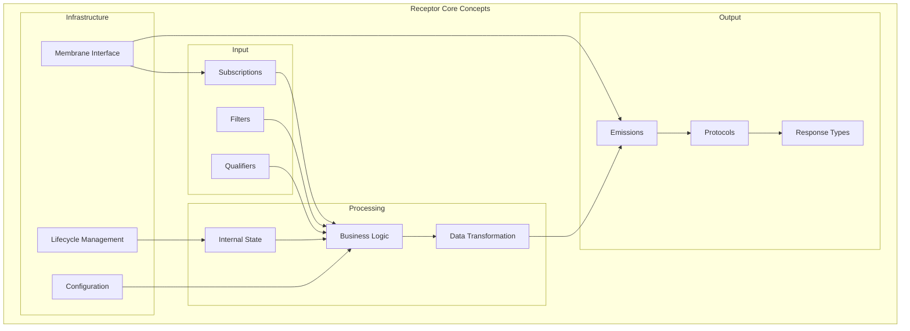

### Key Characteristics

1. **Autonomous Operation**: Receptors operate independently, responding to semantic data
2. **Semantic Awareness**: Subscribe to and emit specific semantic types
3. **State Management**: Can maintain internal state between processing cycles
4. **Dynamic Filtering**: Can qualify which semantic data to process based on content and context
5. **Composable**: Can be combined with other receptors to create complex applications

## Base Receptor Architecture

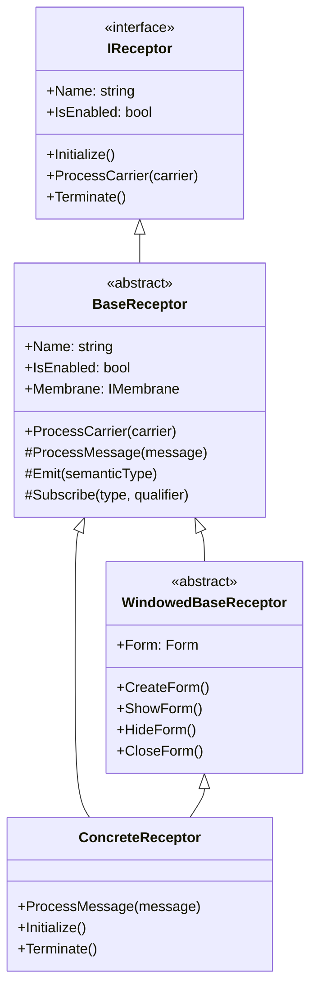

### Core Components

#### BaseReceptor
```csharp
public abstract class BaseReceptor : IReceptor
{
    public string Name { get; set; }
    public bool IsEnabled { get; set; }
    protected IMembrane Membrane { get; set; }
    
    // Subscribe to semantic types
    protected void Subscribe<T>() where T : ISemanticType
    protected void Subscribe<T>(ReceiveQualifier qualifier) where T : ISemanticType
    
    // Emit semantic types
    protected void Emit<T>(T semanticType) where T : ISemanticType
    
    // Process incoming messages
    protected abstract void ProcessMessage(ICarrier carrier);
}
```

#### Subscription and Emission

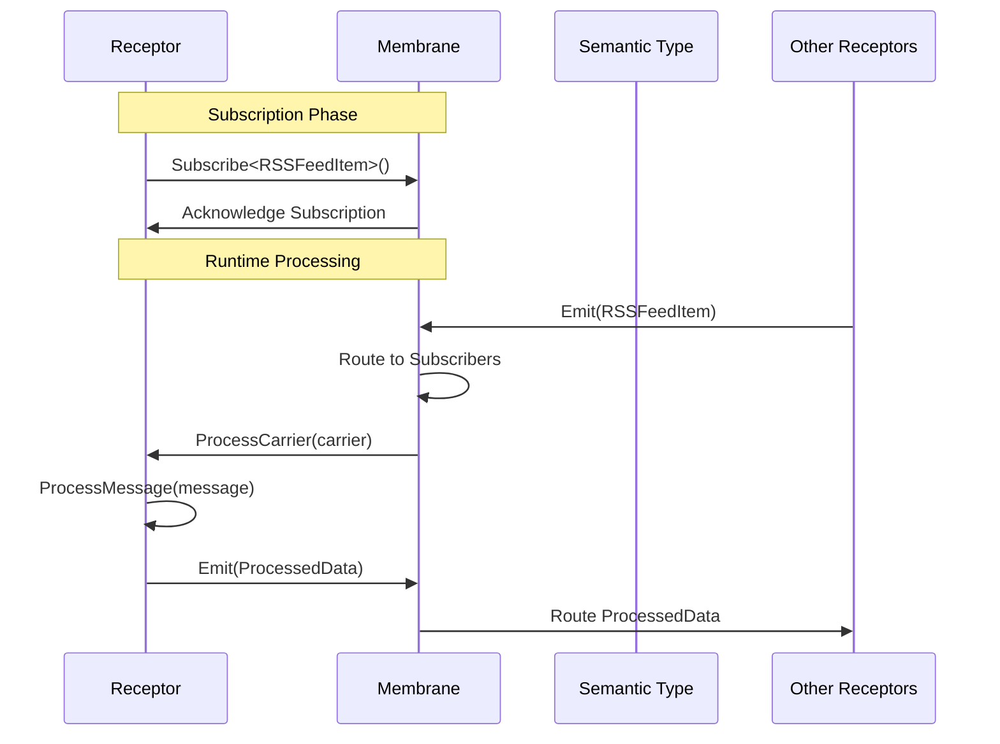

## Receptor Types

### 1. Input Receptors

Input receptors bring external data into the HOPE system by reading from external sources and emitting semantic types.

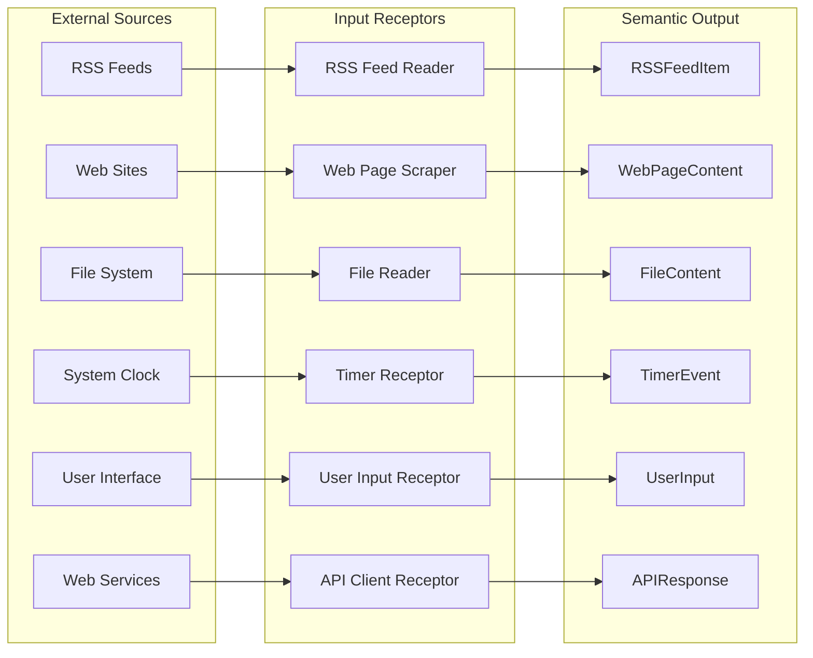

#### Example: RSS Feed Reader Receptor

```csharp
public class RSSFeedReaderReceptor : BaseReceptor
{
    private Timer feedTimer;
    private string feedUrl;
    
    public override void Initialize()
    {
        Subscribe<RSSFeedRequest>();
        feedTimer = new Timer(CheckFeed, null, TimeSpan.Zero, TimeSpan.FromMinutes(15));
    }
    
    protected override void ProcessMessage(ICarrier carrier)
    {
        if (carrier.Message is RSSFeedRequest request)
        {
            feedUrl = request.Url.Value;
            CheckFeed(null);
        }
    }
    
    private void CheckFeed(object state)
    {
        try
        {
            var feed = LoadRSSFeed(feedUrl);
            foreach (var item in feed.Items)
            {
                var rssItem = CreateRSSFeedItem(item);
                Emit(rssItem);
            }
        }
        catch (Exception ex)
        {
            Emit(new ExceptionInfo { Message = ex.Message });
        }
    }
}
```

### 2. Processing Receptors

Processing receptors transform, filter, aggregate, or analyze semantic data.

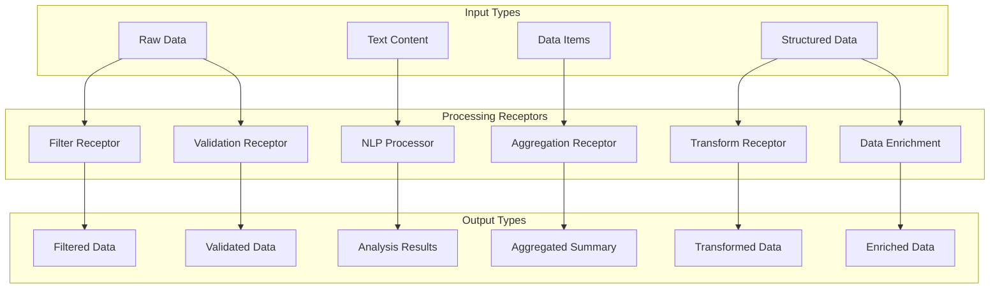

#### Example: Content Filter Receptor

```csharp
public class ContentFilterReceptor : BaseReceptor
{
    private List<string> keywords;
    private FilterMode mode;
    
    public override void Initialize()
    {
        Subscribe<RSSFeedItem>();
        Subscribe<FilterConfiguration>();
    }
    
    protected override void ProcessMessage(ICarrier carrier)
    {
        switch (carrier.Message)
        {
            case FilterConfiguration config:
                keywords = config.Keywords;
                mode = config.Mode;
                break;
                
            case RSSFeedItem item:
                if (ShouldInclude(item))
                {
                    Emit(new FilteredContent
                    {
                        OriginalItem = item,
                        FilterReason = "Keyword match",
                        FilteredAt = DateTime.Now
                    });
                }
                break;
        }
    }
    
    private bool ShouldInclude(RSSFeedItem item)
    {
        var content = $"{item.RSSFeedTitle.Text.Value} {item.RSSFeedDescription.Text.Value}";
        
        return mode == FilterMode.Include
            ? keywords.Any(k => content.Contains(k, StringComparison.OrdinalIgnoreCase))
            : !keywords.Any(k => content.Contains(k, StringComparison.OrdinalIgnoreCase));
    }
}
```

### 3. Output Receptors

Output receptors present data to users or export data to external systems.

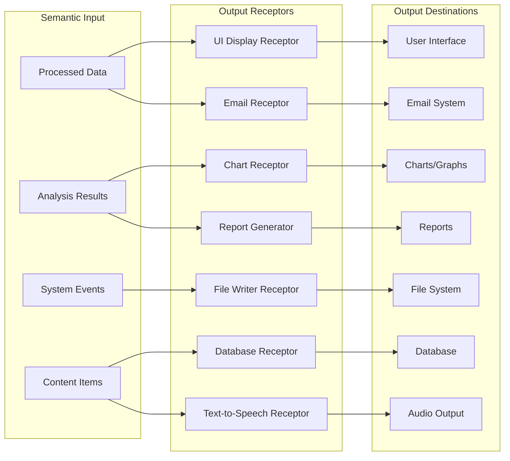

### 4. UI Receptors

UI receptors provide windowed interfaces for user interaction.

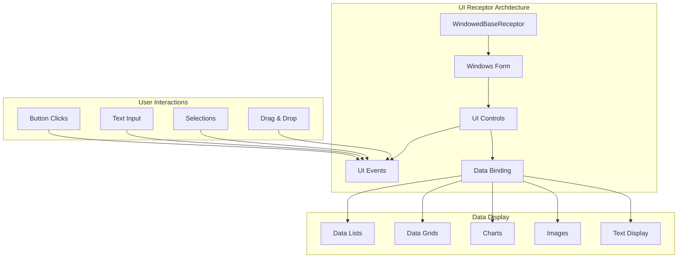

## Communication Patterns

### Subscription Patterns

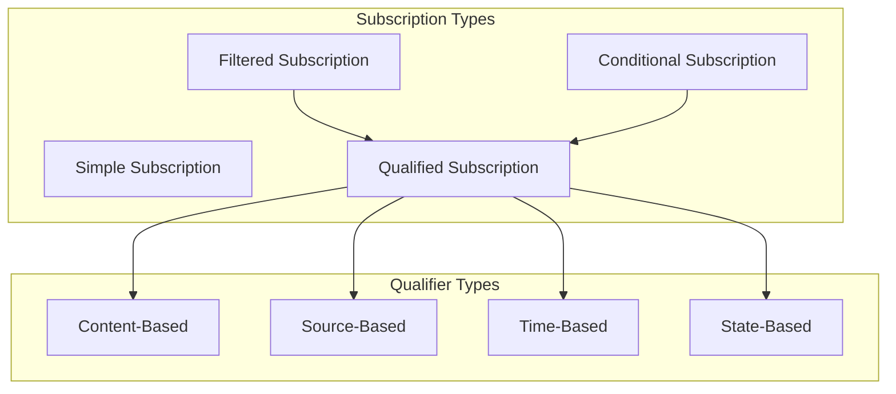

#### Subscription Examples

```csharp
// Simple subscription - receive all instances
Subscribe<RSSFeedItem>();

// Qualified subscription - filter by content
Subscribe<RSSFeedItem>(new ReceiveQualifier
{
    ContentFilter = item => item.RSSFeedName.Text.Value.Contains("Technology")
});

// State-based subscription - conditional on receptor state
Subscribe<TimerEvent>(new ReceiveQualifier
{
    Condition = () => IsProcessingEnabled && !IsBusy
});
```

### Emission Patterns

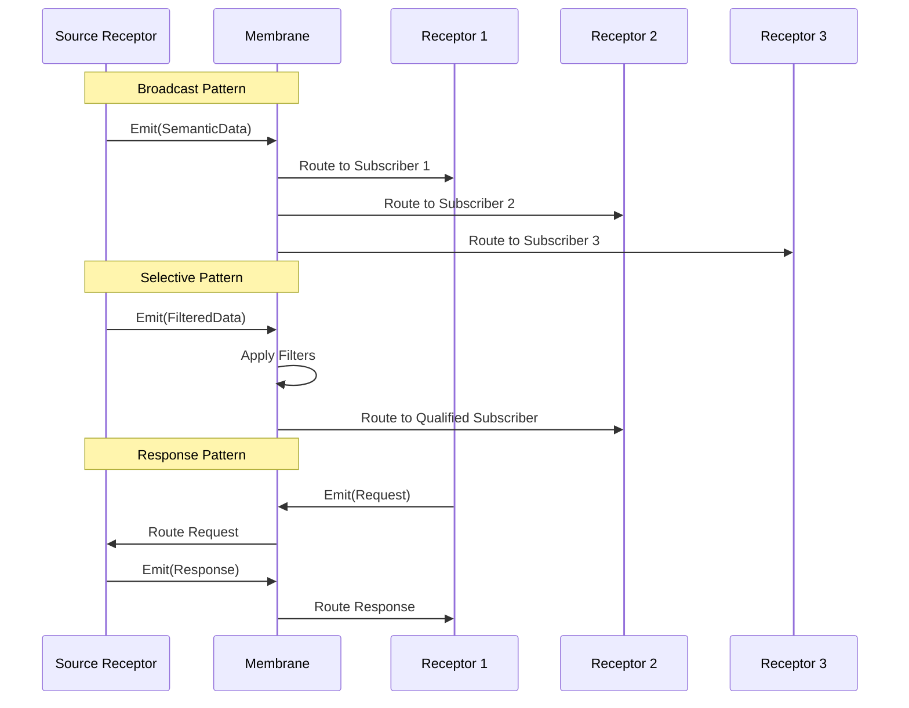

## Lifecycle Management

### Receptor States

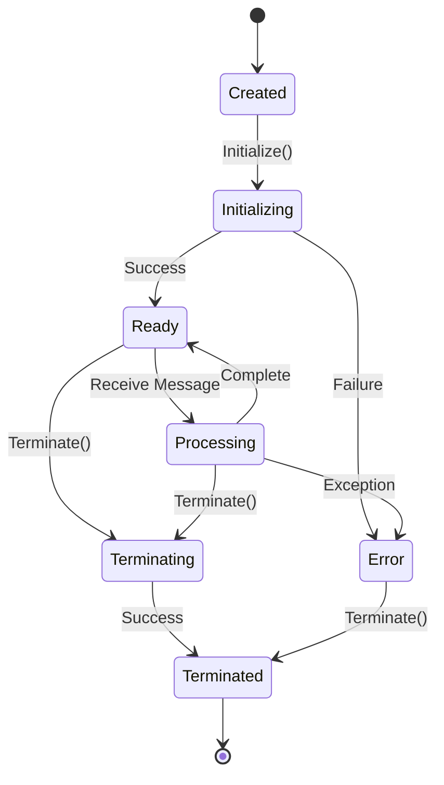

### Lifecycle Events

```csharp
public interface IReceptorLifecycle
{
    event EventHandler<ReceptorEventArgs> Initializing;
    event EventHandler<ReceptorEventArgs> Initialized;
    event EventHandler<ReceptorEventArgs> Processing;
    event EventHandler<ReceptorEventArgs> Processed;
    event EventHandler<ReceptorEventArgs> Terminating;
    event EventHandler<ReceptorEventArgs> Terminated;
    event EventHandler<ReceptorErrorEventArgs> Error;
}
```

## Implementation Patterns

### Template Method Pattern

```csharp
public abstract class DataProcessorReceptor : BaseReceptor
{
    protected override void ProcessMessage(ICarrier carrier)
    {
        try
        {
            // Template method pattern
            var data = ExtractData(carrier);
            var validated = ValidateData(data);
            var processed = ProcessData(validated);
            var result = FormatResult(processed);
            EmitResult(result);
        }
        catch (Exception ex)
        {
            HandleError(ex);
        }
    }
    
    protected abstract object ExtractData(ICarrier carrier);
    protected virtual bool ValidateData(object data) => true;
    protected abstract object ProcessData(object data);
    protected virtual object FormatResult(object processed) => processed;
    protected abstract void EmitResult(object result);
    
    protected virtual void HandleError(Exception ex)
    {
        Emit(new ErrorInfo { Message = ex.Message, Source = Name });
    }
}
```

### Observer Pattern Integration

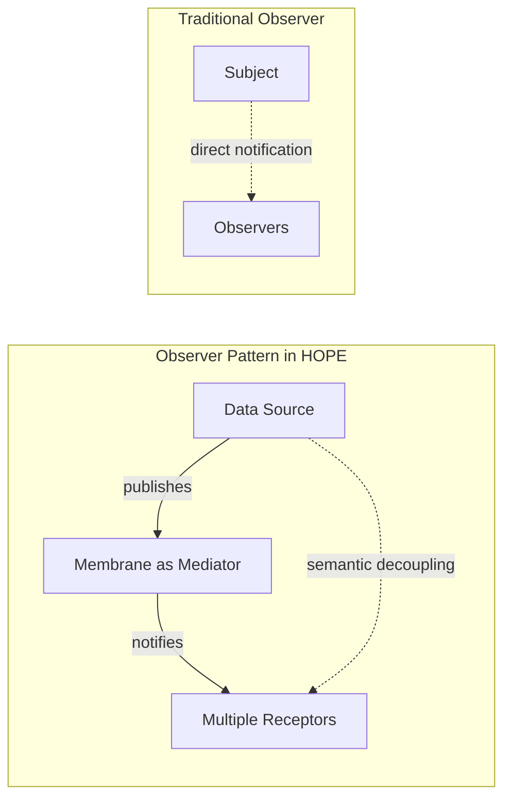

### State Machine Pattern

```csharp
public class StatefulReceptor : BaseReceptor
{
    private enum ProcessingState
    {
        Idle,
        Collecting,
        Processing,
        Outputting
    }
    
    private ProcessingState currentState = ProcessingState.Idle;
    private List<object> collectedData = new List<object>();
    
    protected override void ProcessMessage(ICarrier carrier)
    {
        switch (currentState)
        {
            case ProcessingState.Idle:
                HandleIdleState(carrier);
                break;
            case ProcessingState.Collecting:
                HandleCollectingState(carrier);
                break;
            case ProcessingState.Processing:
                HandleProcessingState(carrier);
                break;
            case ProcessingState.Outputting:
                HandleOutputtingState(carrier);
                break;
        }
    }
    
    private void TransitionTo(ProcessingState newState)
    {
        currentState = newState;
        Emit(new StateTransition { From = currentState, To = newState });
    }
}
```

## Best Practices

### Design Principles

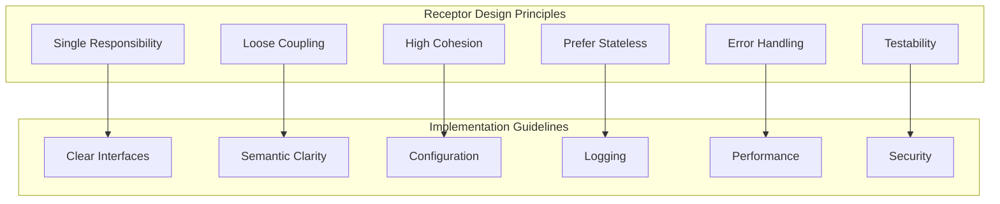

### 1. Single Responsibility
- Each receptor should have one clear purpose
- Avoid combining unrelated functionality

### 2. Semantic Clarity
- Use meaningful semantic type names
- Design types that reflect business concepts

### 3. Error Handling
- Always handle exceptions gracefully
- Emit error semantic types for downstream processing
- Implement proper logging

### 4. State Management
- Prefer stateless receptors when possible
- If state is needed, make it explicit and manageable
- Consider state persistence for critical receptors

### 5. Configuration
- Make receptors configurable through semantic types
- Support runtime reconfiguration when appropriate

### Example: Well-Designed Receptor

```csharp
public class ImageProcessorReceptor : BaseReceptor
{
    private ImageProcessingConfig config;
    
    public override void Initialize()
    {
        Subscribe<ImageFile>();
        Subscribe<ImageProcessingConfig>();
        
        // Default configuration
        config = new ImageProcessingConfig
        {
            MaxWidth = 800,
            MaxHeight = 600,
            Quality = 85
        };
    }
    
    protected override void ProcessMessage(ICarrier carrier)
    {
        try
        {
            switch (carrier.Message)
            {
                case ImageProcessingConfig newConfig:
                    config = newConfig;
                    Emit(new ConfigurationUpdated { Receptor = Name });
                    break;
                    
                case ImageFile imageFile:
                    ProcessImage(imageFile);
                    break;
            }
        }
        catch (Exception ex)
        {
            Emit(new ProcessingError
            {
                Source = Name,
                Message = ex.Message,
                Data = carrier.Message
            });
        }
    }
    
    private void ProcessImage(ImageFile imageFile)
    {
        // Single responsibility: image processing only
        var processedImage = ResizeImage(imageFile, config);
        
        Emit(new ProcessedImage
        {
            OriginalFile = imageFile,
            ProcessedData = processedImage,
            ProcessedAt = DateTime.Now,
            ProcessorConfig = config
        });
        
        // Emit operation completed event
        Emit(new OperationCompleted
        {
            Operation = "ImageProcessing",
            Success = true,
            Duration = TimeSpan.FromMilliseconds(100)
        });
    }
}
```

## Related Documentation

- **[ARCHITECTURE.md](ARCHITECTURE.md)** - Overall system architecture
- **[Semantic-Type-System.md](Semantic-Type-System.md)** - Understanding semantic types used by receptors
- **[Data-Flow.md](Data-Flow.md)** - How data flows between receptors
- **[Examples.md](Examples.md)** - Practical receptor implementation examples