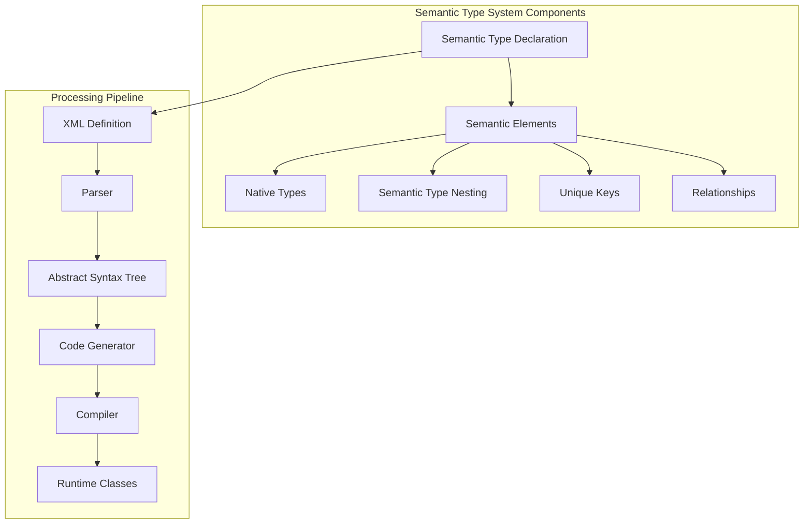
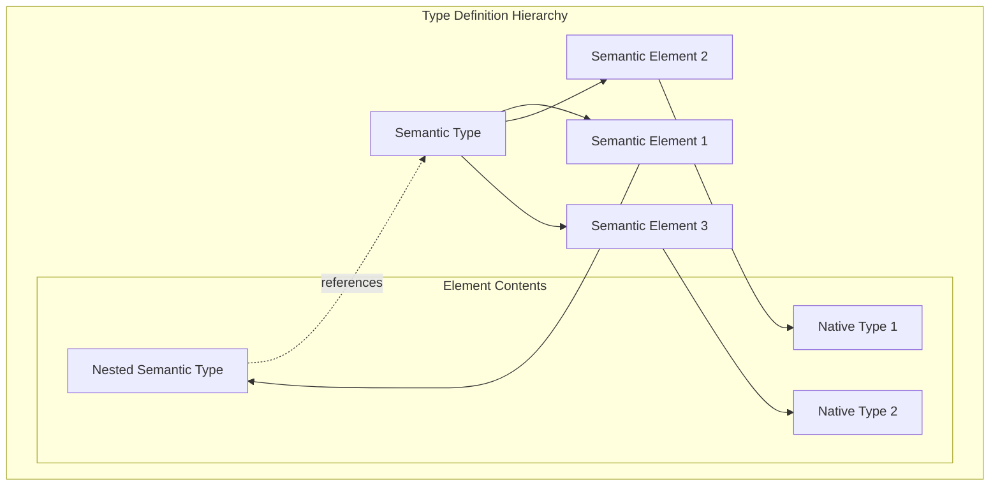
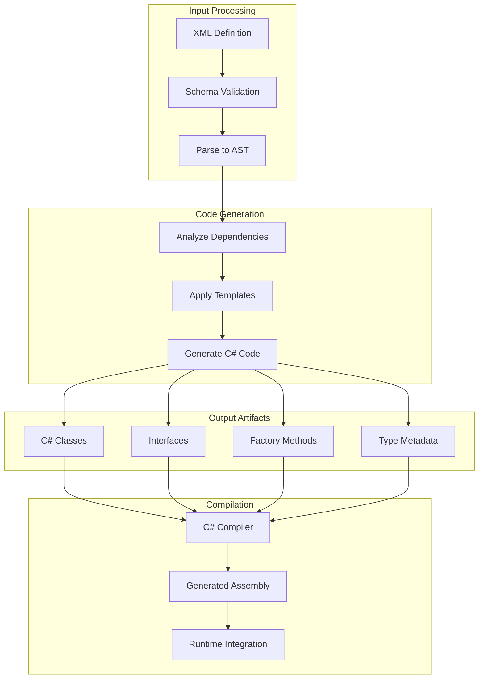
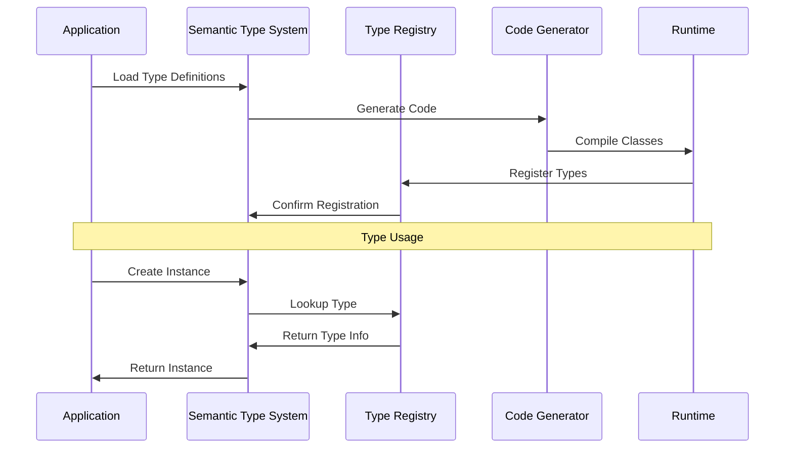
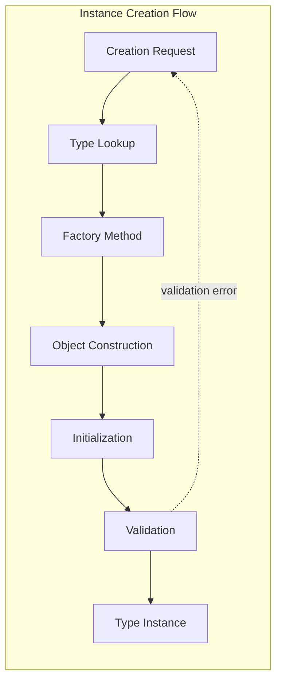
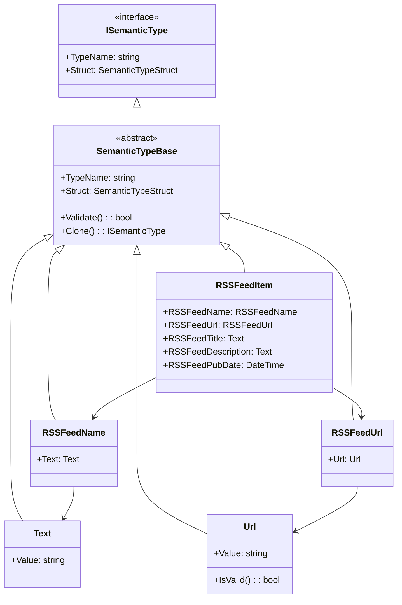
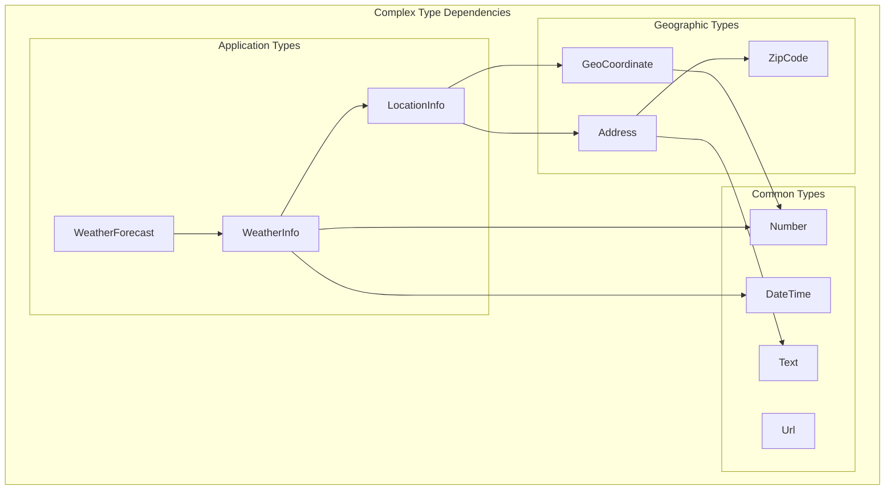
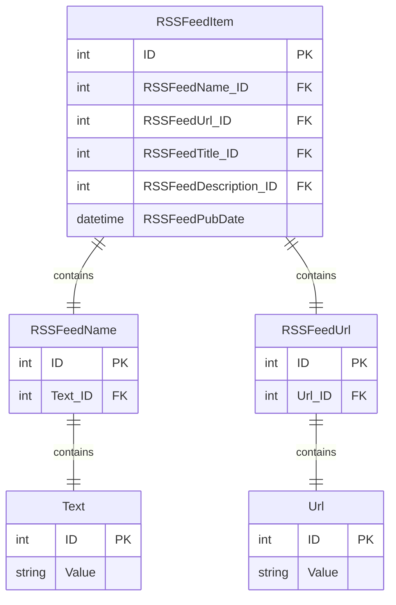
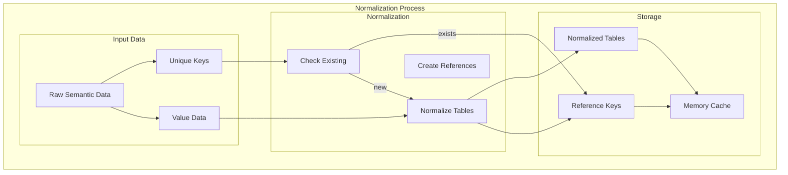
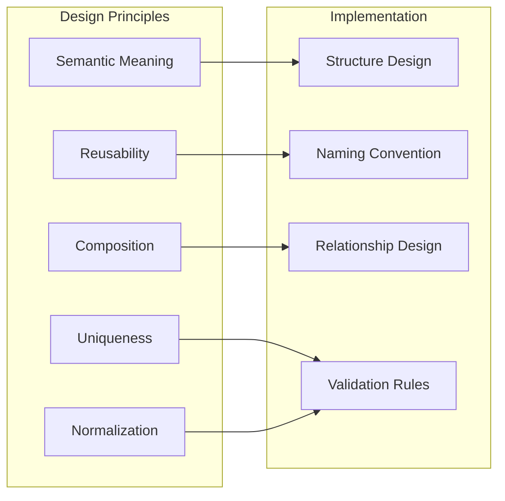

# Semantic Type System Architecture

## Table of Contents
- [Overview](#overview)
- [Core Concepts](#core-concepts)
- [Type Definition](#type-definition)
- [Code Generation](#code-generation)
- [Runtime System](#runtime-system)
- [Type Relationships](#type-relationships)
- [Persistence Model](#persistence-model)
- [Best Practices](#best-practices)

## Overview

The Semantic Type System (STS) is the foundation of the HOPE architecture. It provides a framework for defining structured data types that carry semantic meaning beyond simple data containers. Unlike traditional type systems that focus on data structure, the STS emphasizes the meaning and relationships of data.

## Core Concepts



### Key Principles

1. **Semantic Meaning**: Every type carries semantic information about its purpose and use
2. **Hierarchical Structure**: Types can contain other semantic types, creating rich hierarchies
3. **Unique Identification**: Types can define unique keys for normalization and identity
4. **Relationship Awareness**: Types understand their relationships to other types
5. **Code Generation**: Runtime classes are generated from semantic definitions

## Type Definition

### XML Schema Structure

Semantic types are defined using XML with the following structure:

```xml
<SemanticType Name="TypeName">
  <SemanticElement Name="ElementName" [UniqueKey="true"] [Normalized="true"]>
    <SemanticElement>...</SemanticElement>
    <NativeType Name="PropertyName" Type="DataType" />
  </SemanticElement>
</SemanticType>
```

### Type Definition Architecture



### Example: RSS Feed Item Type

```xml
<SemanticType Name="RSSFeedItem">
  <!-- Unique identifier for the feed source -->
  <SemanticElement Name="RSSFeedName" UniqueKey="true" Normalized="true">
    <SemanticElement Name="Text">
      <NativeType Name="Value" Type="string" />
    </SemanticElement>
  </SemanticElement>
  
  <!-- Unique URL for the specific item -->
  <SemanticElement Name="RSSFeedUrl" UniqueKey="true" Normalized="true">
    <SemanticElement Name="Url">
      <NativeType Name="Value" Type="string" />
    </SemanticElement>
  </SemanticElement>
  
  <!-- Item content (not unique) -->
  <SemanticElement Name="RSSFeedTitle">
    <SemanticElement Name="Text">
      <NativeType Name="Value" Type="string" />
    </SemanticElement>
  </SemanticElement>
  
  <SemanticElement Name="RSSFeedDescription">
    <SemanticElement Name="Text">
      <NativeType Name="Value" Type="string" />
    </SemanticElement>
  </SemanticElement>
  
  <SemanticElement Name="RSSFeedPubDate">
    <NativeType Name="Value" Type="DateTime" />
  </SemanticElement>
</SemanticType>
```

## Code Generation

### Generation Process



### Generated Class Structure

For the RSSFeedItem example above, the system generates:

```csharp
// Main semantic type class
public class RSSFeedItem : ISemanticType
{
    public RSSFeedName RSSFeedName { get; set; }
    public RSSFeedUrl RSSFeedUrl { get; set; }
    public RSSFeedTitle RSSFeedTitle { get; set; }
    public RSSFeedDescription RSSFeedDescription { get; set; }
    public RSSFeedPubDate RSSFeedPubDate { get; set; }
    
    // Semantic type metadata
    public SemanticTypeStruct Struct { get; }
    public string TypeName => "RSSFeedItem";
    
    // Factory methods
    public static RSSFeedItem Create();
    public static RSSFeedItem Create(RSSFeedName name, RSSFeedUrl url);
}

// Component classes
public class RSSFeedName : ISemanticType
{
    public Text Text { get; set; }
    public string TypeName => "RSSFeedName";
}

public class Text : ISemanticType
{
    public string Value { get; set; }
    public string TypeName => "Text";
}
```

## Runtime System

### Type Registration and Discovery



### Type Instance Creation



## Type Relationships

### Inheritance and Composition



### Type Dependencies



## Persistence Model

### Database Schema Generation

The semantic type system automatically generates database schemas that reflect the semantic structure:



### Normalization Strategy



Key principles:
1. **Semantic Tables**: Each semantic type becomes a database table
2. **Foreign Key Structure**: Parent types reference child types via foreign keys
3. **Normalization**: Unique/normalized types prevent data duplication
4. **Thin Tables**: Higher-level tables consist mainly of foreign key references
5. **Native Type Storage**: Only bottom-level tables store actual native type values

## Best Practices

### Type Design Guidelines



### 1. Semantic Meaning First
- Choose type names that reflect business meaning, not technical structure
- Example: `CustomerAddress` not `StringCollection`

### 2. Promote Reusability
- Create common types like `Text`, `Url`, `EmailAddress` for reuse across multiple semantic types
- Avoid duplicating structure in different types

### 3. Design for Composition
- Build complex types from simpler semantic elements
- Use nesting to create hierarchical meaning

### 4. Define Appropriate Uniqueness
- Mark semantic elements as `UniqueKey="true"` when they serve as identifiers
- Use `Normalized="true"` for types that should be deduplicated in storage

### 5. Consider Persistence Implications
- Understand that each semantic type becomes a database table
- Design with the resulting foreign key relationships in mind

### Example: Well-Designed Type

```xml
<!-- Good: Semantic meaning, reusable components, appropriate uniqueness -->
<SemanticType Name="CustomerOrder">
  <SemanticElement Name="OrderNumber" UniqueKey="true" Normalized="true">
    <SemanticElement Name="Text">
      <NativeType Name="Value" Type="string" />
    </SemanticElement>
  </SemanticElement>
  
  <SemanticElement Name="Customer">
    <SemanticElement Name="CustomerID" UniqueKey="true" Normalized="true">
      <NativeType Name="Value" Type="int" />
    </SemanticElement>
    <SemanticElement Name="CustomerName">
      <SemanticElement Name="Text">
        <NativeType Name="Value" Type="string" />
      </SemanticElement>
    </SemanticElement>
  </SemanticElement>
  
  <SemanticElement Name="OrderDate">
    <NativeType Name="Value" Type="DateTime" />
  </SemanticElement>
  
  <SemanticElement Name="TotalAmount">
    <SemanticElement Name="Currency">
      <NativeType Name="Amount" Type="decimal" />
      <NativeType Name="CurrencyCode" Type="string" />
    </SemanticElement>
  </SemanticElement>
</SemanticType>
```

## Related Documentation

- **[ARCHITECTURE.md](ARCHITECTURE.md)** - Overall system architecture
- **[Receptor-Architecture.md](Receptor-Architecture.md)** - How receptors use semantic types
- **[Data-Flow.md](Data-Flow.md)** - How semantic data flows through the system
- **[Examples.md](Examples.md)** - Practical examples of semantic type usage